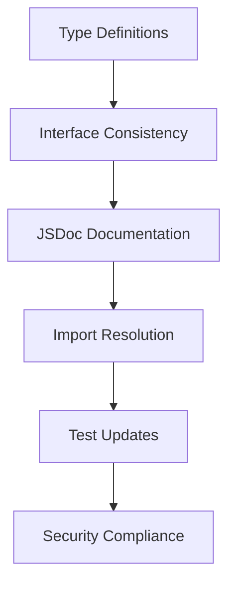

# Design Document

## Overview

This design document outlines the systematic approach to fix all CI failures in PR #4. The failures fall into several categories that need to be addressed in a specific order to ensure dependencies are resolved correctly. The design focuses on maintaining backward compatibility while ensuring all new job queue functionality integrates properly with existing systems.

## Architecture

### Fix Categories and Dependencies



The fixes must be applied in this order due to dependencies between different types of issues.

## Components and Interfaces

### 1. Type System Fixes

**Core Type Issues:**
- Missing `retryCount` property in `JobOptions` interface
- Inconsistent `ConversionResult` interface properties
- Conflicting exports for `SourceLocation`, `APIMapping`, etc.
- Missing properties in worker pool and resource manager interfaces

**Solution Approach:**
- Consolidate duplicate interface definitions
- Add missing required properties to existing interfaces
- Create type compatibility layers where needed
- Ensure consistent property naming across related interfaces

### 2. JSDoc Documentation System

**Documentation Requirements:**
- All public methods need complete JSDoc comments
- Missing @param tags for method parameters
- Missing @returns tags for methods that return values
- Missing descriptions for interfaces and classes

**Documentation Template:**
```typescript
/**
 * Description of the method/class/interface
 * @param {Type} paramName - Description of parameter
 * @returns {Type} Description of return value
 * @example
 * // Usage example for complex methods
 */
```

### 3. Import and Module Resolution

**Import Issues:**
- Missing `jszip` dependency
- Incorrect module exports in index files
- Circular dependency issues
- Type-only imports not properly declared

**Resolution Strategy:**
- Add missing dependencies to package.json
- Fix export statements in index files
- Resolve circular dependencies through interface extraction
- Properly declare type-only imports

### 4. Test Infrastructure Updates

**Test Compatibility Issues:**
- Mock objects don't match updated interfaces
- Test data doesn't conform to new type requirements
- Integration tests use outdated method signatures
- Performance tests use invalid configuration options

**Update Strategy:**
- Update all mock objects to match current interfaces
- Modify test data to include required properties
- Update method calls to use correct signatures
- Fix configuration objects in tests

## Data Models

### Updated Job Interface
```typescript
interface JobOptions {
  timeout: number;
  maxRetries: number;
  retryCount: number; // Added missing property
  priority: JobPriority;
  resourceRequirements: ResourceRequirements;
}
```

### Consolidated ConversionResult Interface
```typescript
interface ConversionResult {
  success: boolean;
  result?: ConversionOutput;
  validation?: ValidationResult;
  errors: ConversionError[];
  warnings: ConversionWarning[];
}
```

### Unified SourceLocation Interface
```typescript
interface SourceLocation {
  file: string;
  line: number;
  column: number;
  startLine: number;
  startColumn: number;
  endLine: number;
  endColumn: number;
}
```

## Error Handling

### Compilation Error Resolution
1. **Type Mismatch Errors:** Update interfaces to include missing properties
2. **Import Errors:** Add missing dependencies and fix export statements
3. **Method Signature Errors:** Update method calls to match current signatures
4. **Generic Type Errors:** Add proper type constraints and parameters

### Runtime Error Prevention
1. **Null/Undefined Checks:** Add proper null checking where needed
2. **Type Guards:** Implement type guards for union types
3. **Default Values:** Provide sensible defaults for optional properties
4. **Error Boundaries:** Ensure proper error handling in async operations

## Testing Strategy

### Unit Test Updates
- Update all job queue related tests to use new interfaces
- Fix mock objects to match current type definitions
- Add tests for new job queue functionality
- Ensure all test data conforms to type requirements

### Integration Test Fixes
- Update end-to-end conversion tests to use correct interfaces
- Fix module interaction tests to use proper method signatures
- Update packaging pipeline tests to handle new job system
- Ensure performance integration tests use valid configurations

### Test Data Consistency
- Create factory functions for generating valid test data
- Ensure all test objects include required properties
- Update helper functions to match current interfaces
- Standardize test configuration objects

## Implementation Phases

### Phase 1: Core Type Fixes
- Fix fundamental type definitions and interfaces
- Resolve conflicting exports
- Add missing required properties
- Ensure type consistency across modules

### Phase 2: Documentation Completion
- Add JSDoc comments to all public methods
- Include proper @param and @returns tags
- Add descriptions to interfaces and classes
- Ensure documentation meets validation requirements

### Phase 3: Import and Dependency Resolution
- Add missing npm dependencies
- Fix module export statements
- Resolve circular dependencies
- Update import statements

### Phase 4: Test Infrastructure Updates
- Update all test files to use correct interfaces
- Fix mock objects and test data
- Update method calls and configurations
- Ensure all tests pass with new implementations

### Phase 5: Security and Quality Compliance
- Address any remaining security scan issues
- Ensure code quality standards are met
- Verify all CI checks pass
- Validate performance requirements are met