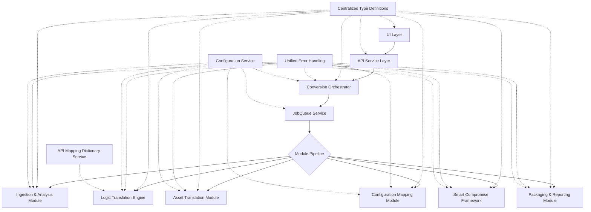

# Design Document: Consistency Improvements

## Overview

The Consistency Improvements project addresses identified inconsistencies and integration issues in the Minecraft Mod Converter codebase. This document outlines the technical design for implementing standardized interfaces, unified error handling, proper UI-backend integration, and other improvements to enhance the maintainability and reliability of the application.

## Architecture

The improvements will be implemented within the existing modular architecture of the Minecraft Mod Converter, focusing on standardization and proper integration between modules. The key architectural enhancements include:

1. **Centralized Type Definitions**
2. **Unified Error Handling System**
3. **API Service Layer**
4. **Integrated Pipeline Orchestration**
5. **Centralized Configuration Management**

### High-Level Architecture Diagram



## Components and Interfaces

### 1. Centralized Type Definitions

**Purpose:** Provide a single source of truth for interface definitions used across the application.

**Components:**
- **BaseTypes**: Core type definitions used throughout the application
- **ModuleInterfaces**: Interface definitions for module inputs and outputs
- **ErrorTypes**: Standardized error and note type definitions
- **ConfigTypes**: Configuration-related type definitions

**Interfaces:**
```typescript
// src/types/base.ts
export interface JavaMod {
  id: string;
  name: string;
  version: string;
  modLoader: 'forge' | 'fabric';
  sourceFiles: JavaSourceFile[];
  assetFiles: AssetFile[];
  configFiles: ConfigFile[];
  license: LicenseInfo;
}

// src/types/errors.ts
export interface ConversionError {
  id: string;
  type: 'validation' | 'asset' | 'config' | 'logic' | 'system';
  severity: 'info' | 'warning' | 'error' | 'critical';
  message: string;
  sourceLocation?: SourceLocation;
  recommendedFix?: string;
  moduleOrigin: string;
  timestamp: Date;
}
```

### 2. Unified Error Handling System

**Purpose:** Standardize error reporting, collection, and presentation across all modules.

**Components:**
- **ErrorCollector**: Service for collecting and aggregating errors from all modules
- **ErrorReporter**: Component for formatting and presenting errors to users
- **ErrorClassifier**: Logic for categorizing errors by severity and type

**Interfaces:**
```typescript
// src/services/ErrorCollector.ts
export interface ErrorCollectorOptions {
  maxErrors?: number;
  groupSimilarErrors?: boolean;
}

export class ErrorCollector {
  public addError(error: ConversionError): void;
  public addErrors(errors: ConversionError[]): void;
  public getErrors(filter?: ErrorFilter): ConversionError[];
  public getErrorSummary(): ErrorSummary;
  public clear(): void;
}
```

### 3. API Service Layer

**Purpose:** Connect UI components with backend services through a consistent API.

**Components:**
- **ConversionAPIService**: Service for initiating and monitoring conversions
- **SettingsAPIService**: Service for managing user preferences
- **ReportAPIService**: Service for retrieving conversion reports

**Interfaces:**
```typescript
// src/modules/ui/services/ConversionAPIService.ts
export interface ConversionAPIService {
  startConversion(input: ConversionInput): Promise<ConversionJob>;
  getConversionStatus(jobId: string): Promise<ConversionStatus>;
  cancelConversion(jobId: string): Promise<boolean>;
  getConversionResult(jobId: string): Promise<ConversionResult>;
}
```

### 4. Integrated Pipeline Orchestration

**Purpose:** Properly integrate the JobQueue service with the conversion pipeline.

**Components:**
- **ConversionOrchestrator**: Service for coordinating the conversion process
- **JobProcessor**: Component for processing jobs from the queue
- **ResourceManager**: Service for allocating resources to jobs

**Interfaces:**
```typescript
// src/services/ConversionOrchestrator.ts
export interface ConversionOrchestrator {
  queueConversion(input: ConversionInput): Promise<string>; // Returns job ID
  processNextJob(): Promise<void>;
  getJobStatus(jobId: string): JobStatus;
  cancelJob(jobId: string): Promise<boolean>;
}
```

### 5. Centralized Configuration Management

**Purpose:** Provide a single source for configuration values across the application.

**Components:**
- **ConfigurationService**: Service for managing application configuration
- **ConfigValidator**: Component for validating configuration values
- **EnvironmentManager**: Service for loading environment-specific configuration

**Interfaces:**
```typescript
// src/services/ConfigurationService.ts
export interface ConfigurationService {
  get<T>(key: string, defaultValue?: T): T;
  set<T>(key: string, value: T): void;
  getSection(section: string): Record<string, any>;
  reload(): Promise<void>;
  validate(): ConfigValidationResult;
}
```

### 6. API Mapping Dictionary Service

**Purpose:** Manage and provide access to Java-to-Bedrock API mappings.

**Components:**
- **APIMapperService**: Service for retrieving and managing API mappings
- **MappingDatabase**: Component for storing and versioning mappings
- **MappingUpdater**: Service for updating mappings from external sources

**Interfaces:**
```typescript
// src/services/APIMapperService.ts
export interface APIMapperService {
  getMapping(javaSignature: string): APIMapping | undefined;
  getMappings(filter?: MappingFilter): APIMapping[];
  addMapping(mapping: APIMapping): Promise<void>;
  updateMapping(mapping: APIMapping): Promise<void>;
  importMappings(mappings: APIMapping[]): Promise<ImportResult>;
}
```

## Data Models

### Core Data Models

#### Error Models

```typescript
interface ConversionError {
  id: string;
  type: 'validation' | 'asset' | 'config' | 'logic' | 'system';
  severity: 'info' | 'warning' | 'error' | 'critical';
  message: string;
  sourceLocation?: SourceLocation;
  recommendedFix?: string;
  moduleOrigin: string;
  timestamp: Date;
}

interface ErrorSummary {
  totalErrors: number;
  bySeverity: Record<ConversionError['severity'], number>;
  byType: Record<ConversionError['type'], number>;
  byModule: Record<string, number>;
  mostCritical: ConversionError[];
}
```

#### Configuration Models

```typescript
interface ConfigurationValue<T> {
  key: string;
  value: T;
  defaultValue: T;
  description?: string;
  validation?: (value: T) => boolean;
}

interface ConfigSection {
  name: string;
  description?: string;
  values: Record<string, ConfigurationValue<any>>;
}

interface ConfigValidationResult {
  isValid: boolean;
  invalidValues: {
    key: string;
    value: any;
    reason: string;
  }[];
}
```

#### API Mapping Models

```typescript
interface APIMapping {
  id: string;
  javaSignature: string;
  bedrockEquivalent: string;
  conversionType: 'direct' | 'wrapper' | 'complex' | 'impossible';
  notes: string;
  exampleUsage?: {
    java: string;
    bedrock: string;
  };
  version: string;
  lastUpdated: Date;
}

interface MappingFilter {
  conversionType?: APIMapping['conversionType'];
  version?: string;
  search?: string;
}

interface ImportResult {
  added: number;
  updated: number;
  failed: number;
  failures: {
    mapping: APIMapping;
    reason: string;
  }[];
}
```

## Implementation Approach

### 1. Interface Standardization

1. **Create Type Directory Structure**:
   - Create `src/types` directory with subdirectories for different domains
   - Move existing interfaces to appropriate files
   - Update import statements across the codebase

2. **Align with Design Document**:
   - Review all interfaces against the design document
   - Update interfaces to match the design specifications
   - Document any intentional deviations

3. **Standardize Naming Conventions**:
   - Create naming convention guidelines
   - Refactor interface names to follow consistent patterns
   - Ensure property names use consistent terminology

### 2. Error Handling Standardization

1. **Create Error Models**:
   - Define standardized error interfaces
   - Implement error severity classification
   - Create error code system

2. **Implement ErrorCollector Service**:
   - Create service for collecting errors from all modules
   - Implement error aggregation and grouping
   - Add error summary generation

3. **Refactor Module Error Handling**:
   - Update each module to use the standardized error interfaces
   - Integrate with ErrorCollector service
   - Ensure consistent error reporting

### 3. UI-Backend Integration

1. **Create API Service Layer**:
   - Implement services for UI-backend communication
   - Replace simulated data with actual API calls
   - Add proper error handling

2. **Align Progress Tracking**:
   - Update UI progress tracking to match pipeline stages
   - Implement real-time progress updates
   - Add detailed status messages

3. **Implement State Management**:
   - Add state management solution
   - Create actions and reducers for conversion process
   - Ensure UI components react to state changes

### 4. JobQueue Integration

1. **Create ConversionOrchestrator**:
   - Implement service to coordinate conversion process
   - Add job creation and management
   - Implement status tracking

2. **Refactor Pipeline**:
   - Update pipeline to process jobs from queue
   - Add proper job completion handling
   - Implement resource allocation

3. **Add Monitoring**:
   - Create admin interface for job monitoring
   - Implement job prioritization
   - Add job cancellation functionality

### 5. Configuration Management

1. **Create ConfigurationService**:
   - Implement service for managing configuration
   - Move hardcoded values to configuration
   - Add environment-specific configuration

2. **Refactor Services**:
   - Update services to use ConfigurationService
   - Add configuration validation
   - Implement safe defaults

3. **Add Dynamic Updates**:
   - Implement runtime configuration updates
   - Create admin interface
   - Add version control

## Testing Strategy

The testing strategy for the consistency improvements will focus on ensuring that the standardization efforts do not break existing functionality while validating the new integration points:

1. **Interface Compliance Tests**:
   - Validate that all modules implement interfaces correctly
   - Test edge cases for interface contracts
   - Verify type safety across module boundaries

2. **Error Handling Tests**:
   - Test error collection and aggregation
   - Verify error classification and reporting
   - Test error handling in edge cases

3. **Integration Tests**:
   - Test UI-backend integration
   - Verify JobQueue integration with pipeline
   - Test configuration service integration

4. **Regression Tests**:
   - Ensure existing functionality works correctly
   - Verify performance is maintained or improved
   - Test backward compatibility

5. **Documentation Tests**:
   - Validate JSDoc coverage
   - Verify documentation accuracy
   - Test developer onboarding process

## Migration Strategy

To minimize disruption while implementing these improvements, we will follow a phased migration approach:

1. **Phase 1: Preparation**
   - Create centralized type definitions
   - Implement core services (ErrorCollector, ConfigurationService)
   - Add parallel implementations without removing existing code

2. **Phase 2: Module Migration**
   - Migrate one module at a time to use new interfaces and services
   - Run parallel tests to ensure functionality is preserved
   - Address any issues before proceeding to the next module

3. **Phase 3: Integration**
   - Connect UI with backend services
   - Integrate JobQueue with pipeline
   - Implement API Mapping Dictionary Service

4. **Phase 4: Cleanup**
   - Remove deprecated code
   - Finalize documentation
   - Complete testing and validation

## Future Considerations

1. **Performance Monitoring**:
   - Add detailed performance metrics for each module
   - Implement performance regression detection
   - Create performance optimization recommendations

2. **Enhanced Telemetry**:
   - Add more detailed logging
   - Implement usage analytics
   - Create operational dashboards

3. **Extensibility Framework**:
   - Design plugin architecture for custom modules
   - Implement extension points for third-party integrations
   - Create developer SDK for extensions