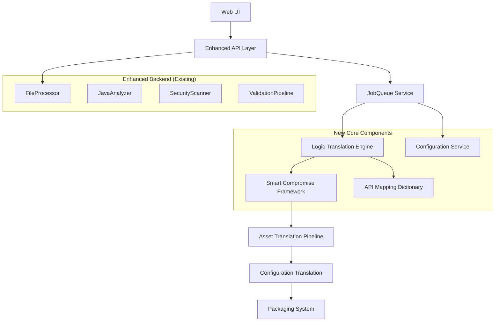

# Design Document

## Overview

This design document outlines the implementation of core functionality that transforms the enhanced ModPorter-AI components into a complete, production-ready Minecraft mod conversion system. The design focuses on connecting the user interface to backend services, implementing the core logic translation engine, building intelligent compromise strategies, and completing the end-to-end conversion pipeline.

The architecture leverages the existing enhanced file processing, multi-strategy analysis, and specialized conversion agents while adding the missing pieces needed for a fully functional user-facing system.

## Architecture

### System Integration Overview

The core functionality implementation connects existing enhanced components with new core systems:



### Component Integration Strategy

1. **UI Integration Layer**: Connects React frontend to enhanced backend services
2. **Logic Translation Engine**: Core AST + LLM-based code conversion system
3. **Smart Compromise Framework**: Intelligent handling of unconvertible features
4. **Centralized Services**: JobQueue, Configuration, and API Mapping services
5. **Complete Pipeline**: Asset, configuration, and packaging systems

## Components and Interfaces

### 1. Enhanced UI Integration Layer

**Location**: `src/ui/enhanced/`

```typescript
export interface ConversionUIState {
  currentStage: ConversionStage;
  progress: ProgressInfo;
  errors: UIError[];
  warnings: UIWarning[];
  results: ConversionResults;
}

export interface ConversionStage {
  name: string;
  status: 'pending' | 'running' | 'completed' | 'failed';
  progress: number;
  details: StageDetails;
}

export class EnhancedConversionUI {
  private conversionService: ConversionService;
  private jobQueue: JobQueueService;
  private configService: ConfigurationService;
  
  async initiateConversion(file: File, options: ConversionOptions): Promise<string>;
  async getConversionProgress(jobId: string): Promise<ConversionUIState>;
  async cancelConversion(jobId: string): Promise<void>;
  private updateProgressDisplay(progress: ProgressInfo): void;
  private displayResults(results: ConversionResults): void;
}
```

### 2. Logic Translation Engine

**Location**: `src/modules/logic/`

```typescript
export interface LogicTranslationEngine {
  translateJavaCode(javaCode: string, context: TranslationContext): Promise<TranslationResult>;
  parseToMMIR(javaCode: string): Promise<MMIRRepresentation>;
  transpileAST(mmir: MMIRRepresentation): Promise<JavaScriptCode>;
  translateWithLLM(complexCode: string, context: TranslationContext): Promise<LLMTranslationResult>;
  validateTranslation(original: string, translated: string): Promise<ValidationResult>;
}

export interface MMIRRepresentation {
  ast: ASTNode[];
  metadata: CodeMetadata;
  dependencies: Dependency[];
  complexity: ComplexityMetrics;
}

export interface TranslationContext {
  modInfo: ModInfo;
  apiMappings: APIMapping[];
  targetVersion: string;
  compromiseStrategy: CompromiseStrategy;
}

export class LogicTranslationEngine {
  private astTranspiler: ASTTranspiler;
  private llmTranslator: LLMTranslator;
  private apiMappingService: APIMappingService;
  private programStateValidator: ProgramStateValidator;
  
  async translateJavaCode(javaCode: string, context: TranslationContext): Promise<TranslationResult> {
    // Parse Java code to MMIR
    const mmir = await this.parseToMMIR(javaCode);
    
    // Attempt AST-based transpilation for mappable patterns
    const astResult = await this.transpileAST(mmir);
    
    // Use LLM for complex/unmappable code
    const llmResult = await this.translateWithLLM(astResult.unmappableCode, context);
    
    // Validate functional equivalence
    const validation = await this.validateTranslation(javaCode, astResult.code + llmResult.code);
    
    // Iteratively refine if needed
    if (!validation.isEquivalent) {
      return await this.refineTranslation(javaCode, astResult, llmResult, context);
    }
    
    return {
      success: true,
      code: this.integrateResults(astResult, llmResult),
      metadata: this.generateMetadata(mmir, validation)
    };
  }
}
```

### 3. Smart Compromise Framework

**Location**: `src/modules/compromise/`

```typescript
export interface CompromiseStrategy {
  name: string;
  applicableFeatures: FeatureType[];
  priority: number;
  implementation: CompromiseImplementation;
}

export interface CompromiseImplementation {
  analyze(feature: UnmappableFeature): Promise<CompromiseAnalysis>;
  implement(feature: UnmappableFeature, context: CompromiseContext): Promise<CompromiseResult>;
  validate(result: CompromiseResult): Promise<ValidationResult>;
}

export class SmartCompromiseFramework {
  private strategies: Map<FeatureType, CompromiseStrategy[]>;
  private userPreferences: CompromisePreferences;
  
  async handleUnmappableFeature(feature: UnmappableFeature): Promise<CompromiseResult> {
    const applicableStrategies = this.getApplicableStrategies(feature);
    const selectedStrategy = this.selectBestStrategy(applicableStrategies, feature);
    
    const analysis = await selectedStrategy.implementation.analyze(feature);
    const result = await selectedStrategy.implementation.implement(feature, {
      userPreferences: this.userPreferences,
      modContext: feature.context
    });
    
    await selectedStrategy.implementation.validate(result);
    
    return {
      originalFeature: feature,
      strategy: selectedStrategy,
      implementation: result,
      documentation: this.generateDocumentation(feature, selectedStrategy, result)
    };
  }
  
  private selectBestStrategy(strategies: CompromiseStrategy[], feature: UnmappableFeature): CompromiseStrategy {
    // Strategy selection logic based on feature type, user preferences, and effectiveness
    return strategies.reduce((best, current) => {
      const bestScore = this.scoreStrategy(best, feature);
      const currentScore = this.scoreStrategy(current, feature);
      return currentScore > bestScore ? current : best;
    });
  }
}
```

### 4. JobQueue Service

**Location**: `src/services/JobQueueService.ts`

```typescript
export interface Job {
  id: string;
  type: JobType;
  priority: JobPriority;
  status: JobStatus;
  payload: JobPayload;
  progress: JobProgress;
  createdAt: Date;
  startedAt?: Date;
  completedAt?: Date;
  error?: JobError;
}

export interface JobProgress {
  stage: string;
  percentage: number;
  estimatedTimeRemaining?: number;
  details: ProgressDetails;
}

export class JobQueueService {
  private queue: PriorityQueue<Job>;
  private workers: WorkerPool;
  private statusStore: JobStatusStore;
  
  async enqueueJob(jobData: JobData): Promise<string> {
    const job = this.createJob(jobData);
    await this.queue.enqueue(job);
    await this.statusStore.saveJob(job);
    
    this.processNextJob();
    return job.id;
  }
  
  async getJobStatus(jobId: string): Promise<Job | null> {
    return await this.statusStore.getJob(jobId);
  }
  
  async cancelJob(jobId: string): Promise<boolean> {
    const job = await this.statusStore.getJob(jobId);
    if (!job) return false;
    
    if (job.status === 'running') {
      await this.workers.cancelJob(jobId);
    }
    
    job.status = 'cancelled';
    await this.statusStore.updateJob(job);
    return true;
  }
  
  private async processNextJob(): Promise<void> {
    if (this.workers.hasAvailableWorker()) {
      const job = await this.queue.dequeue();
      if (job) {
        await this.executeJob(job);
      }
    }
  }
}
```

### 5. API Mapping Dictionary Service

**Location**: `src/services/APIMappingService.ts`

```typescript
export interface APIMapping {
  javaAPI: JavaAPISignature;
  bedrockAPI: BedrockAPISignature;
  mappingType: MappingType;
  confidence: number;
  notes?: string;
  examples?: MappingExample[];
}

export interface JavaAPISignature {
  className: string;
  methodName: string;
  parameters: Parameter[];
  returnType: string;
  modLoader: 'forge' | 'fabric';
}

export interface BedrockAPISignature {
  namespace: string;
  functionName: string;
  parameters: Parameter[];
  returnType: string;
  apiVersion: string;
}

export class APIMappingService {
  private mappings: Map<string, APIMapping>;
  private cache: LRUCache<string, APIMapping>;
  private validator: MappingValidator;
  
  async getMappingForJavaAPI(javaSignature: JavaAPISignature): Promise<APIMapping | null> {
    const key = this.generateMappingKey(javaSignature);
    
    // Check cache first
    let mapping = this.cache.get(key);
    if (mapping) return mapping;
    
    // Search mappings
    mapping = this.mappings.get(key);
    if (mapping) {
      this.cache.set(key, mapping);
      return mapping;
    }
    
    // Try fuzzy matching for similar APIs
    return await this.findSimilarMapping(javaSignature);
  }
  
  async updateMappings(newMappings: APIMapping[]): Promise<ValidationResult> {
    const validationResults = await Promise.all(
      newMappings.map(mapping => this.validator.validateMapping(mapping))
    );
    
    const validMappings = newMappings.filter((_, index) => validationResults[index].isValid);
    
    for (const mapping of validMappings) {
      const key = this.generateMappingKey(mapping.javaAPI);
      this.mappings.set(key, mapping);
    }
    
    // Clear cache to force reload
    this.cache.clear();
    
    return {
      totalMappings: newMappings.length,
      validMappings: validMappings.length,
      errors: validationResults.filter(r => !r.isValid).map(r => r.error)
    };
  }
}
```

### 6. Asset Translation Pipeline

**Location**: `src/modules/assets/AssetTranslationPipeline.ts`

```typescript
export interface AssetTranslationPipeline {
  translateAssets(assets: JavaAssetCollection): Promise<BedrockAssetCollection>;
  validateAssets(assets: BedrockAssetCollection): Promise<AssetValidationResult>;
  optimizeAssets(assets: BedrockAssetCollection): Promise<OptimizedAssetCollection>;
}

export class AssetTranslationPipeline {
  private textureConverter: TextureConverter;
  private modelConverter: ModelConverter;
  private soundConverter: SoundConverter;
  private particleMapper: ParticleMapper;
  
  async translateAssets(assets: JavaAssetCollection): Promise<BedrockAssetCollection> {
    const results = await Promise.allSettled([
      this.textureConverter.convertTextures(assets.textures),
      this.modelConverter.convertModels(assets.models),
      this.soundConverter.convertSounds(assets.sounds),
      this.particleMapper.mapParticles(assets.particles)
    ]);
    
    return {
      textures: this.extractResult(results[0]),
      models: this.extractResult(results[1]),
      sounds: this.extractResult(results[2]),
      particles: this.extractResult(results[3]),
      metadata: this.generateAssetMetadata(assets, results)
    };
  }
  
  async validateAssets(assets: BedrockAssetCollection): Promise<AssetValidationResult> {
    const validationTasks = [
      this.validateTextureFormats(assets.textures),
      this.validateModelGeometry(assets.models),
      this.validateSoundFormats(assets.sounds),
      this.validateParticleReferences(assets.particles)
    ];
    
    const results = await Promise.all(validationTasks);
    
    return {
      isValid: results.every(r => r.isValid),
      errors: results.flatMap(r => r.errors),
      warnings: results.flatMap(r => r.warnings),
      summary: this.generateValidationSummary(results)
    };
  }
}
```

### 7. Configuration Translation System

**Location**: `src/modules/configuration/ConfigurationTranslator.ts`

```typescript
export interface ConfigurationTranslator {
  translateManifest(javaManifest: JavaManifest): Promise<BedrockManifest>;
  translateRecipes(recipes: JavaRecipe[]): Promise<BedrockRecipe[]>;
  translateLootTables(lootTables: JavaLootTable[]): Promise<BedrockLootTable[]>;
  translateBlockDefinitions(blocks: JavaBlockDefinition[]): Promise<BedrockBlockDefinition[]>;
  translateItemDefinitions(items: JavaItemDefinition[]): Promise<BedrockItemDefinition[]>;
}

export class ConfigurationTranslator {
  private manifestGenerator: ManifestGenerator;
  private recipeTranslator: RecipeTranslator;
  private lootTableTranslator: LootTableTranslator;
  private blockDefinitionTranslator: BlockDefinitionTranslator;
  private itemDefinitionTranslator: ItemDefinitionTranslator;
  
  async translateAllConfigurations(javaConfig: JavaConfiguration): Promise<BedrockConfiguration> {
    const translations = await Promise.allSettled([
      this.translateManifest(javaConfig.manifest),
      this.translateRecipes(javaConfig.recipes),
      this.translateLootTables(javaConfig.lootTables),
      this.translateBlockDefinitions(javaConfig.blocks),
      this.translateItemDefinitions(javaConfig.items)
    ]);
    
    return {
      manifest: this.extractResult(translations[0]),
      recipes: this.extractResult(translations[1]),
      lootTables: this.extractResult(translations[2]),
      blocks: this.extractResult(translations[3]),
      items: this.extractResult(translations[4]),
      validationResults: await this.validateConfigurations(translations)
    };
  }
}
```

### 8. Packaging System

**Location**: `src/modules/packaging/PackagingSystem.ts`

```typescript
export interface PackagingSystem {
  packageAddon(components: ConversionComponents): Promise<AddonPackage>;
  generateReport(conversionData: ConversionData): Promise<ConversionReport>;
  validatePackage(addonPackage: AddonPackage): Promise<PackageValidationResult>;
}

export class PackagingSystem {
  private manifestGenerator: ManifestGenerator;
  private fileOrganizer: FileOrganizer;
  private packageValidator: PackageValidator;
  private reportGenerator: ReportGenerator;
  
  async packageAddon(components: ConversionComponents): Promise<AddonPackage> {
    // Generate manifests for behavior and resource packs
    const behaviorManifest = await this.manifestGenerator.generateBehaviorManifest(components);
    const resourceManifest = await this.manifestGenerator.generateResourceManifest(components);
    
    // Organize files according to Bedrock structure
    const organizedFiles = await this.fileOrganizer.organizeFiles(components);
    
    // Create .mcaddon package
    const packageBuffer = await this.createMcAddonPackage({
      behaviorPack: {
        manifest: behaviorManifest,
        files: organizedFiles.behaviorPack
      },
      resourcePack: {
        manifest: resourceManifest,
        files: organizedFiles.resourcePack
      }
    });
    
    return {
      buffer: packageBuffer,
      metadata: this.generatePackageMetadata(components),
      structure: organizedFiles
    };
  }
  
  async generateReport(conversionData: ConversionData): Promise<ConversionReport> {
    return await this.reportGenerator.generateComprehensiveReport({
      originalMod: conversionData.originalMod,
      conversionResults: conversionData.results,
      compromises: conversionData.compromises,
      assets: conversionData.assets,
      configurations: conversionData.configurations,
      validationResults: conversionData.validation,
      performance: conversionData.performance
    });
  }
}
```

## Data Models

### Core Translation Models

```typescript
export interface TranslationResult {
  success: boolean;
  code: string;
  metadata: TranslationMetadata;
  compromises: CompromiseResult[];
  warnings: TranslationWarning[];
  errors: TranslationError[];
}

export interface TranslationMetadata {
  originalLinesOfCode: number;
  translatedLinesOfCode: number;
  astTranslationPercentage: number;
  llmTranslationPercentage: number;
  complexityScore: number;
  confidenceScore: number;
}

export interface CompromiseResult {
  originalFeature: UnmappableFeature;
  strategy: CompromiseStrategy;
  implementation: CompromiseImplementation;
  documentation: CompromiseDocumentation;
  userImpact: UserImpactAssessment;
}
```

### Job Management Models

```typescript
export interface JobData {
  type: 'conversion' | 'validation' | 'analysis';
  priority: 'low' | 'normal' | 'high' | 'urgent';
  payload: ConversionRequest | ValidationRequest | AnalysisRequest;
  options: JobOptions;
}

export interface ConversionRequest {
  fileBuffer: Buffer;
  filename: string;
  options: ConversionOptions;
  userPreferences: UserPreferences;
}

export interface JobOptions {
  timeout: number;
  retryCount: number;
  notificationEndpoint?: string;
  priority: JobPriority;
}
```

### Asset and Configuration Models

```typescript
export interface BedrockAssetCollection {
  textures: BedrockTexture[];
  models: BedrockModel[];
  sounds: BedrockSound[];
  particles: BedrockParticle[];
  metadata: AssetMetadata;
}

export interface BedrockConfiguration {
  manifest: BedrockManifest;
  recipes: BedrockRecipe[];
  lootTables: BedrockLootTable[];
  blocks: BedrockBlockDefinition[];
  items: BedrockItemDefinition[];
  validationResults: ConfigurationValidationResult;
}
```

## Error Handling Strategy

### Unified Error Management

```typescript
export class UnifiedErrorHandler {
  private errorCollector: EnhancedErrorCollector;
  private errorRecovery: ErrorRecoveryService;
  private errorMonitoring: ErrorMonitoringService;
  
  async handleError(error: SystemError, context: ErrorContext): Promise<ErrorHandlingResult> {
    // Collect and categorize error
    await this.errorCollector.collectError(error, context);
    
    // Attempt recovery if possible
    const recoveryResult = await this.errorRecovery.attemptRecovery(error, context);
    
    // Monitor and alert if necessary
    await this.errorMonitoring.processError(error, context, recoveryResult);
    
    return {
      handled: true,
      recovered: recoveryResult.success,
      userMessage: this.generateUserMessage(error, recoveryResult),
      technicalDetails: this.generateTechnicalDetails(error, context)
    };
  }
}
```

## Performance Considerations

### Scalability Architecture

1. **Parallel Processing**: Logic translation and asset conversion run in parallel
2. **Resource Management**: JobQueue manages system resources and prevents overload
3. **Caching Strategy**: API mappings and analysis results are cached for performance
4. **Streaming Processing**: Large files are processed in streams to manage memory
5. **Worker Pool**: Background workers handle CPU-intensive tasks

### Memory Management

```typescript
export class ResourceManager {
  private memoryMonitor: MemoryMonitor;
  private resourceAllocator: ResourceAllocator;
  
  async allocateResourcesForJob(job: Job): Promise<ResourceAllocation> {
    const requirements = this.calculateResourceRequirements(job);
    const availability = await this.memoryMonitor.getAvailableResources();
    
    if (availability.memory < requirements.memory) {
      await this.freeUnusedResources();
    }
    
    return await this.resourceAllocator.allocate(requirements);
  }
}
```

## Security Considerations

### Enhanced Security Integration

1. **Input Validation**: All user inputs validated through enhanced FileProcessor
2. **Code Execution Prevention**: Generated JavaScript is sandboxed and validated
3. **Resource Limits**: JobQueue enforces resource limits to prevent DoS
4. **Audit Logging**: All conversion activities are logged for security monitoring
5. **Access Control**: API endpoints protected with appropriate authentication

## Testing Strategy

### Comprehensive Testing Approach

```typescript
export class IntegrationTestSuite {
  async testEndToEndConversion(): Promise<TestResult> {
    // Test complete conversion pipeline
    const testMod = await this.loadTestMod('simple-forge-mod.jar');
    const result = await this.conversionService.convertMod(testMod);
    
    // Validate all components
    await this.validateLogicTranslation(result.logic);
    await this.validateAssetConversion(result.assets);
    await this.validateConfigurationTranslation(result.configuration);
    await this.validatePackaging(result.package);
    
    return this.generateTestReport(result);
  }
  
  async testCompromiseStrategies(): Promise<TestResult> {
    // Test various unmappable features
    const unmappableFeatures = await this.loadUnmappableFeatures();
    const results = await Promise.all(
      unmappableFeatures.map(feature => 
        this.compromiseFramework.handleUnmappableFeature(feature)
      )
    );
    
    return this.validateCompromiseResults(results);
  }
}
```

## Deployment Strategy

### Phased Rollout Plan

1. **Phase 1**: UI Integration and JobQueue (Week 1-2)
2. **Phase 2**: Logic Translation Engine Core (Week 3-5)
3. **Phase 3**: Smart Compromise Framework (Week 6-7)
4. **Phase 4**: Asset and Configuration Translation (Week 8-9)
5. **Phase 5**: Packaging and Final Integration (Week 10-11)

### Feature Flag Strategy

```typescript
export const CORE_FUNCTIONALITY_FEATURES = {
  ENHANCED_UI_INTEGRATION: 'enhanced_ui_integration',
  LOGIC_TRANSLATION_ENGINE: 'logic_translation_engine',
  SMART_COMPROMISE_FRAMEWORK: 'smart_compromise_framework',
  COMPLETE_ASSET_PIPELINE: 'complete_asset_pipeline',
  ADVANCED_PACKAGING: 'advanced_packaging'
} as const;
```

## Monitoring and Observability

### Key Metrics

1. **Conversion Success Rate**: Percentage of successful end-to-end conversions
2. **Logic Translation Accuracy**: Functional equivalence validation results
3. **Compromise Strategy Effectiveness**: User satisfaction with compromise implementations
4. **System Performance**: Processing times, resource usage, queue lengths
5. **Error Rates**: Component-specific error rates and recovery success

### Alerting Strategy

1. **Conversion Failures**: Alert on conversion failure rate > 10%
2. **Performance Degradation**: Alert on processing time > 5 minutes
3. **Resource Exhaustion**: Alert on memory/CPU usage > 90%
4. **Queue Backlog**: Alert on job queue length > 50
5. **Component Failures**: Alert on any component failure rate > 5%

This design provides a comprehensive architecture for implementing the core functionality that transforms the enhanced ModPorter-AI components into a complete, production-ready mod conversion system.