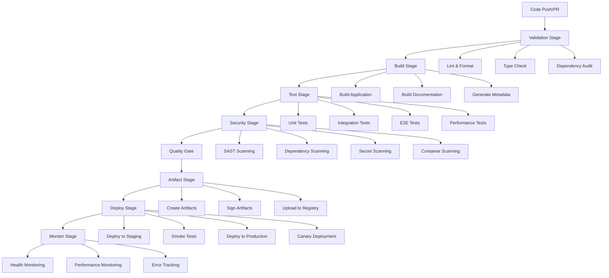

# Design Document

## Overview

The enhanced GitHub Actions workflow system will provide a comprehensive CI/CD pipeline that modernizes the current basic workflow with advanced features including parallel testing, security scanning, automated deployments, intelligent caching, and comprehensive monitoring. The design leverages existing deployment infrastructure while adding sophisticated automation, security, and observability capabilities.

The system will implement a multi-stage pipeline with clear separation of concerns: continuous integration (CI) for code quality and testing, continuous deployment (CD) for automated releases, and continuous monitoring for operational excellence. The workflow will integrate seamlessly with the existing ModPorter-AI deployment scripts and infrastructure.

## Architecture

### Workflow Structure

The enhanced GitHub Actions workflow will be organized into multiple workflow files, each with specific responsibilities:

1. **Main CI Workflow** (`ci.yml`) - Core continuous integration pipeline
2. **Security Workflow** (`security.yml`) - Dedicated security scanning and compliance
3. **Deployment Workflow** (`deploy.yml`) - Environment-specific deployment automation
4. **Dependency Management** (`dependencies.yml`) - Automated dependency updates
5. **Performance Monitoring** (`performance.yml`) - Performance regression testing
6. **Release Management** (`release.yml`) - Automated release creation and artifact management

### Pipeline Stages

The CI/CD pipeline will consist of the following stages:



### Matrix Build Strategy

The workflow will implement a comprehensive matrix build strategy to ensure compatibility across different environments:

- **Node.js Versions**: 18.x (LTS), 20.x (LTS), 22.x (Current)
- **Operating Systems**: Ubuntu 22.04, macOS 13, Windows 2022
- **Test Suites**: Unit, Integration, Security, Performance
- **Build Configurations**: Development, Production, Debug

### Caching Strategy

Intelligent caching will be implemented at multiple levels:

1. **Dependency Caching**: Cache `node_modules` based on `package-lock.json` hash
2. **Build Caching**: Cache TypeScript compilation outputs
3. **Test Caching**: Cache test results for unchanged files
4. **Docker Layer Caching**: Cache container layers for deployment
5. **Artifact Caching**: Cache build artifacts between stages

## Components and Interfaces

### Workflow Components

#### 1. CI Controller
- **Purpose**: Orchestrates the main CI pipeline
- **Responsibilities**: 
  - Trigger appropriate workflows based on events
  - Manage workflow dependencies and sequencing
  - Handle failure scenarios and notifications
- **Interface**: GitHub Actions workflow triggers and job dependencies

#### 2. Test Orchestrator
- **Purpose**: Manages parallel test execution across matrix builds
- **Responsibilities**:
  - Execute test suites in parallel
  - Collect and aggregate test results
  - Generate coverage reports
  - Handle test failures and retries
- **Interface**: Vitest configuration and existing test scripts

#### 3. Security Scanner
- **Purpose**: Performs comprehensive security analysis
- **Responsibilities**:
  - Run SAST (Static Application Security Testing)
  - Scan dependencies for vulnerabilities
  - Detect secrets and sensitive information
  - Generate security reports and alerts
- **Interface**: Security scanning tools (CodeQL, npm audit, GitLeaks)

#### 4. Deployment Manager
- **Purpose**: Handles automated deployments across environments
- **Responsibilities**:
  - Execute environment-specific deployments
  - Manage feature flag configurations
  - Perform health checks and rollbacks
  - Coordinate with existing deployment scripts
- **Interface**: Existing deployment scripts and infrastructure APIs

#### 5. Artifact Manager
- **Purpose**: Manages build artifacts and releases
- **Responsibilities**:
  - Create versioned artifacts
  - Sign and verify artifacts
  - Upload to artifact registries
  - Generate release notes
- **Interface**: GitHub Packages, artifact signing services

#### 6. Monitoring Integration
- **Purpose**: Integrates CI/CD metrics with monitoring systems
- **Responsibilities**:
  - Collect pipeline metrics
  - Send deployment notifications
  - Track performance trends
  - Generate operational dashboards
- **Interface**: Existing monitoring configuration and alerting systems

### Integration Points

#### Existing Infrastructure Integration
The workflow will integrate with existing project infrastructure:

1. **Deployment Scripts**: Leverage `scripts/deploy-modporter-ai.sh`, `scripts/canary-deployment.sh`
2. **Test Infrastructure**: Use `scripts/run-comprehensive-tests.js` and existing test suites
3. **Validation Scripts**: Integrate `scripts/validate-deployment.js` for deployment validation
4. **Configuration Management**: Use existing `config/` files for environment-specific settings
5. **Health Endpoints**: Integrate with existing health check endpoints (`/health`, `/ready`, `/live`)

#### External Service Integration
- **GitHub Packages**: For artifact storage and distribution
- **CodeQL**: For static code analysis and security scanning
- **npm audit**: For dependency vulnerability scanning
- **Slack/Email**: For notification and alerting
- **Monitoring Systems**: Integration with existing monitoring configuration

## Data Models

### Workflow Configuration Model
```typescript
interface WorkflowConfig {
  name: string;
  triggers: WorkflowTrigger[];
  jobs: WorkflowJob[];
  environment: EnvironmentConfig;
  matrix: MatrixConfig;
  caching: CachingConfig;
  notifications: NotificationConfig;
}

interface WorkflowTrigger {
  event: 'push' | 'pull_request' | 'schedule' | 'workflow_dispatch';
  branches?: string[];
  paths?: string[];
  schedule?: string;
}

interface WorkflowJob {
  id: string;
  name: string;
  runsOn: string | string[];
  needs?: string[];
  if?: string;
  steps: WorkflowStep[];
  strategy?: MatrixStrategy;
  timeout: number;
}
```

### Test Results Model
```typescript
interface TestResults {
  suite: string;
  status: 'passed' | 'failed' | 'skipped';
  duration: number;
  coverage: CoverageReport;
  failures: TestFailure[];
  performance: PerformanceMetrics;
}

interface CoverageReport {
  lines: CoverageMetric;
  functions: CoverageMetric;
  branches: CoverageMetric;
  statements: CoverageMetric;
}

interface CoverageMetric {
  total: number;
  covered: number;
  percentage: number;
}
```

### Deployment Model
```typescript
interface DeploymentConfig {
  environment: 'staging' | 'production' | 'canary';
  strategy: 'blue-green' | 'rolling' | 'canary';
  healthChecks: HealthCheck[];
  rollbackConfig: RollbackConfig;
  featureFlags: FeatureFlagConfig;
  monitoring: MonitoringConfig;
}

interface HealthCheck {
  endpoint: string;
  timeout: number;
  retries: number;
  expectedStatus: number;
  expectedResponse?: string;
}
```

### Security Scan Model
```typescript
interface SecurityScanResults {
  timestamp: string;
  scanType: 'sast' | 'dependency' | 'secret' | 'container';
  status: 'passed' | 'failed' | 'warning';
  vulnerabilities: Vulnerability[];
  summary: SecuritySummary;
}

interface Vulnerability {
  id: string;
  severity: 'critical' | 'high' | 'medium' | 'low';
  title: string;
  description: string;
  file?: string;
  line?: number;
  remediation?: string;
}
```

## Error Handling

### Failure Scenarios and Recovery

#### 1. Test Failures
- **Unit Test Failures**: Block PR merge, provide detailed failure reports
- **Integration Test Failures**: Block deployment, trigger investigation workflow
- **Performance Test Failures**: Create warnings, allow manual override for non-critical changes
- **Security Test Failures**: Block deployment, require security team approval

#### 2. Build Failures
- **Compilation Errors**: Immediate failure with detailed error logs
- **Dependency Issues**: Automatic retry with cache invalidation
- **Resource Exhaustion**: Scale up runners or queue for retry

#### 3. Deployment Failures
- **Health Check Failures**: Automatic rollback to previous version
- **Canary Deployment Issues**: Gradual rollback with monitoring
- **Infrastructure Issues**: Retry with exponential backoff, escalate to operations

#### 4. Security Scan Failures
- **High/Critical Vulnerabilities**: Block deployment, create security issues
- **Dependency Vulnerabilities**: Automatic PR creation for updates
- **Secret Detection**: Immediate notification, block deployment

### Retry and Recovery Mechanisms

1. **Automatic Retries**: Transient failures retry up to 3 times with exponential backoff
2. **Manual Retries**: Failed workflows can be manually re-triggered
3. **Partial Retries**: Individual jobs can be retried without re-running entire workflow
4. **Rollback Procedures**: Automated rollback for deployment failures
5. **Circuit Breakers**: Prevent cascading failures in dependent systems

## Testing Strategy

### Test Automation Levels

#### 1. Unit Testing
- **Scope**: Individual modules and functions
- **Tools**: Vitest with existing test infrastructure
- **Coverage**: Minimum 80% line coverage requirement
- **Execution**: Parallel execution across matrix builds
- **Reporting**: Coverage reports uploaded to GitHub and external services

#### 2. Integration Testing
- **Scope**: Module interactions and API endpoints
- **Tools**: Existing integration test suite
- **Environment**: Isolated test environment with test databases
- **Data**: Test fixtures and generated test data
- **Validation**: End-to-end workflow validation

#### 3. Security Testing
- **Scope**: Security vulnerabilities and compliance
- **Tools**: CodeQL, npm audit, GitLeaks, custom security tests
- **Coverage**: OWASP Top 10, dependency vulnerabilities, secret detection
- **Reporting**: Security dashboard with vulnerability tracking

#### 4. Performance Testing
- **Scope**: Performance regression and load testing
- **Tools**: Existing benchmark suite and performance tests
- **Metrics**: Response times, throughput, resource utilization
- **Thresholds**: Configurable performance budgets

#### 5. End-to-End Testing
- **Scope**: Complete user workflows and system integration
- **Tools**: Existing E2E test infrastructure
- **Environment**: Production-like staging environment
- **Scenarios**: Critical user paths and edge cases

### Test Data Management

1. **Test Fixtures**: Version-controlled test data and mock objects
2. **Generated Data**: Dynamic test data generation for comprehensive coverage
3. **Environment Isolation**: Separate test databases and services
4. **Data Cleanup**: Automatic cleanup of test data after execution
5. **Seed Data**: Consistent seed data for reproducible tests

### Quality Gates

Quality gates will be enforced at multiple stages:

1. **Code Quality Gate**: Linting, formatting, type checking
2. **Test Quality Gate**: Minimum test coverage and pass rates
3. **Security Quality Gate**: No high/critical vulnerabilities
4. **Performance Quality Gate**: Performance budgets and regression limits
5. **Deployment Quality Gate**: Health checks and smoke tests

## Implementation Plan

### Phase 1: Core CI Enhancement (Weeks 1-2)
- Implement matrix builds across Node.js versions and OS
- Add intelligent caching for dependencies and builds
- Enhance test execution with parallel processing
- Integrate coverage reporting and quality gates

### Phase 2: Security Integration (Weeks 3-4)
- Implement SAST scanning with CodeQL
- Add dependency vulnerability scanning
- Integrate secret detection and prevention
- Create security reporting and alerting

### Phase 3: Deployment Automation (Weeks 5-6)
- Implement automated staging deployments
- Add canary deployment capabilities
- Integrate with existing deployment scripts
- Implement rollback automation

### Phase 4: Monitoring and Observability (Weeks 7-8)
- Add pipeline metrics collection
- Implement deployment monitoring
- Create performance tracking
- Add alerting and notification systems

### Phase 5: Advanced Features (Weeks 9-10)
- Implement dependency update automation
- Add release management automation
- Create compliance and audit capabilities
- Optimize performance and cost

### Migration Strategy

1. **Gradual Migration**: Implement new workflows alongside existing ones
2. **Feature Flags**: Use feature flags to control workflow behavior
3. **Rollback Plan**: Maintain ability to revert to previous workflow
4. **Testing**: Extensive testing in development branches
5. **Documentation**: Comprehensive documentation and training

### Risk Mitigation

1. **Backup Workflows**: Maintain existing workflows as backup
2. **Monitoring**: Comprehensive monitoring of new workflow performance
3. **Gradual Rollout**: Phase rollout across different repositories
4. **Team Training**: Training sessions for development and operations teams
5. **Support Plan**: Dedicated support during migration period
