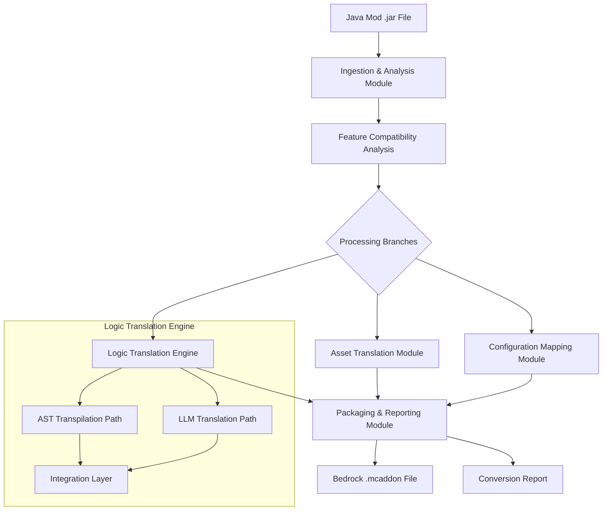

# Design Document: Minecraft Mod Converter

## Overview

The Minecraft Mod Converter is a sophisticated application designed to translate Minecraft Java Edition mods into Bedrock Edition addons. This document outlines the technical architecture and design decisions for implementing this hybrid translation pipeline, which combines Abstract Syntax Tree (AST) based code transpilation with Large Language Model (LLM) semantic reasoning capabilities.

The system acknowledges the fundamental architectural differences between Java and Bedrock platforms and employs a "Smart Compromise" framework to handle features that cannot be directly translated while preserving the original mod's core functionality and experience.

## Architecture

The application follows a modular, pipeline-based architecture with five distinct phases:

1. **Ingestion & Analysis Module**
2. **Asset Translation Module**
3. **Configuration Mapping Module**
4. **Logic Translation Engine**
5. **Packaging & Reporting Module**

Each module operates independently with well-defined interfaces, allowing for parallel development, easier testing, and future extensibility.

### High-Level Architecture Diagram



## Components and Interfaces

### 1. Ingestion & Analysis Module

**Purpose:** Accept Java mod input, validate it, and perform initial analysis.

**Components:**
- **Mod Validator**: Verifies the uploaded .jar file is a valid Minecraft mod.
- **Source Code Fetcher**: Retrieves unobfuscated source code from GitHub if a repository link is provided.
- **Mod Loader Detector**: Identifies whether the mod uses Forge or Fabric API.
- **License Parser**: Extracts and interprets the mod's license terms.
- **Feature Compatibility Analyzer**: Categorizes mod features into the four tiers of conversion feasibility.

**Interfaces:**
```typescript
interface ModInput {
  jarFile: Buffer;
  sourceCodeRepo?: string;
}

interface AnalysisResult {
  modId: string;
  modName: string;
  modVersion: string;
  modLoader: 'forge' | 'fabric';
  license: LicenseInfo;
  compatibilityReport: FeatureCompatibilityReport;
}

interface FeatureCompatibilityReport {
  tier1Features: Feature[]; // Fully Translatable
  tier2Features: Feature[]; // Approximation Possible
  tier3Features: Feature[]; // Natively Impossible
  tier4Features: Feature[]; // Unanalyzable
}
```

### 2. Asset Translation Module

**Purpose:** Convert all visual and auditory assets from Java format to Bedrock format.

**Components:**
- **Texture Converter**: Processes and reorganizes texture files.
- **Model Converter**: Transforms Java block/item models to Bedrock geometry.
- **Sound Processor**: Converts sound files and generates sounds.json.
- **Particle Mapper**: Maps Java particle effects to Bedrock equivalents.

**Interfaces:**
```typescript
interface AssetTranslationInput {
  javaAssets: {
    textures: TextureFile[];
    models: ModelFile[];
    sounds: SoundFile[];
    particles: ParticleDefinition[];
  };
}

interface AssetTranslationOutput {
  bedrockAssets: {
    textures: BedrockTextureFile[];
    models: BedrockModelFile[];
    sounds: BedrockSoundFile[];
    particles: BedrockParticleFile[];
  };
  conversionNotes: AssetConversionNote[];
}
```

### 3. Configuration Mapping Module

**Purpose:** Translate static definition files and metadata.

**Components:**
- **Manifest Generator**: Creates Bedrock manifest.json files.
- **Block/Item Definition Converter**: Transforms Java block/item registrations to Bedrock JSON.
- **Recipe Converter**: Converts crafting recipes to Bedrock format.
- **Loot Table Converter**: Transforms loot tables to Bedrock schema.

**Interfaces:**
```typescript
interface ConfigMappingInput {
  javaManifest: JavaModManifest;
  javaRegistrations: JavaRegistrationCode[];
  javaRecipes: JavaRecipe[];
  javaLootTables: JavaLootTable[];
}

interface ConfigMappingOutput {
  bedrockManifests: {
    behaviorPack: BedrockManifest;
    resourcePack: BedrockManifest;
  };
  bedrockDefinitions: {
    blocks: BedrockBlockDefinition[];
    items: BedrockItemDefinition[];
  };
  bedrockRecipes: BedrockRecipe[];
  bedrockLootTables: BedrockLootTable[];
  conversionNotes: ConfigConversionNote[];
}
```

### 4. Logic Translation Engine

**Purpose:** Convert Java code to JavaScript for Bedrock's Scripting API.

**Components:**
- **Java Parser**: Parses Java code into AST.
- **MMIR Generator**: Transforms Java AST into Minecraft Modding Intermediate Representation.
- **AST Transpiler**: Converts MMIR to JavaScript for directly mappable patterns.
- **API Mapping Dictionary**: Contains mappings between Java and Bedrock API calls.
- **LLM Translation Service**: Handles complex code using semantic understanding.
- **Program State Alignment Validator**: Ensures functional equivalence of translations.
- **JavaScript Generator**: Produces final JavaScript code from transformed AST.

**Interfaces:**
```typescript
interface LogicTranslationInput {
  javaSourceFiles: JavaSourceFile[];
  mmirContext: MMIRContext;
  apiMappingDictionary: APIMapping[];
}

interface LogicTranslationOutput {
  javascriptFiles: JavaScriptFile[];
  stubFunctions: StubFunction[];
  conversionNotes: LogicConversionNote[];
}

interface MMIRContext {
  nodes: MMIRNode[];
  relationships: MMIRRelationship[];
  metadata: MMIRMetadata;
}
```

### 5. Packaging & Reporting Module

**Purpose:** Assemble translated components into a valid .mcaddon package and generate reports.

**Components:**
- **Addon Packager**: Assembles all components into the .mcaddon structure.
- **Addon Validator**: Validates the package against Bedrock specifications.
- **Report Generator**: Creates comprehensive conversion reports.

**Interfaces:**
```typescript
interface PackagingInput {
  bedrockAssets: BedrockAssetCollection;
  bedrockConfigs: BedrockConfigCollection;
  bedrockScripts: JavaScriptFile[];
  conversionNotes: ConversionNote[];
  licenseInfo: LicenseInfo;
}

interface PackagingOutput {
  mcaddonFile: Buffer;
  conversionReport: ConversionReport;
}

interface ConversionReport {
  summary: ConversionSummary;
  featureCompatibility: FeatureCompatibilityReport;
  compromiseStrategies: CompromiseStrategy[];
  manualPostProcessingSteps: PostProcessingStep[];
}
```

## Data Models

### Core Data Models

#### Mod Representation

```typescript
interface JavaMod {
  id: string;
  name: string;
  version: string;
  modLoader: 'forge' | 'fabric';
  sourceFiles: JavaSourceFile[];
  assetFiles: AssetFile[];
  configFiles: ConfigFile[];
  license: LicenseInfo;
}

interface BedrockAddon {
  behaviorPack: {
    manifest: BedrockManifest;
    scripts: JavaScriptFile[];
    definitions: BedrockDefinitionFile[];
  };
  resourcePack: {
    manifest: BedrockManifest;
    textures: TextureFile[];
    models: ModelFile[];
    sounds: SoundFile[];
  };
}
```

#### Feature Compatibility Models

```typescript
interface Feature {
  id: string;
  name: string;
  description: string;
  compatibilityTier: 1 | 2 | 3 | 4;
  sourceFiles: string[];
  sourceLineNumbers: number[][];
  compromiseStrategy?: CompromiseStrategy;
}

interface CompromiseStrategy {
  type: 'simulation' | 'stubbing' | 'approximation';
  description: string;
  implementationDetails: string;
  limitations: string[];
}
```

#### Minecraft Modding Intermediate Representation (MMIR)

```typescript
interface MMIRNode {
  id: string;
  type: MMIRNodeType;
  sourceLocation: SourceLocation;
  properties: Record<string, any>;
  children: string[]; // IDs of child nodes
}

enum MMIRNodeType {
  ModDeclaration,
  EventHandler,
  BlockDefinition,
  ItemDefinition,
  EntityDefinition,
  Function,
  Method,
  Field,
  // ... other node types
}
```

### API Mapping Dictionary

```typescript
interface APIMapping {
  javaSignature: string;
  bedrockEquivalent: string;
  conversionType: 'direct' | 'wrapper' | 'complex' | 'impossible';
  notes: string;
  exampleUsage?: {
    java: string;
    bedrock: string;
  };
}
```

## Error Handling

The system implements a comprehensive error handling strategy:

1. **Validation Errors**: Caught during the ingestion phase, providing immediate feedback to users about invalid inputs.

2. **Conversion Errors**: Handled gracefully within each module:
   - For asset conversion failures, the system will use placeholder assets and log the issue.
   - For configuration mapping failures, the system will use default values where possible.
   - For logic translation failures, the system will implement stub functions.

3. **System Errors**: Unexpected errors are logged with detailed context for debugging, while presenting user-friendly error messages.

4. **Error Reporting**: All errors are included in the final conversion report, categorized by severity and with recommendations for manual fixes.

```typescript
interface ConversionError {
  type: 'validation' | 'asset' | 'config' | 'logic' | 'system';
  severity: 'warning' | 'error' | 'critical';
  message: string;
  sourceLocation?: SourceLocation;
  recommendedFix?: string;
}
```

## Testing Strategy

The testing strategy for the Minecraft Mod Converter is multi-layered:

1. **Unit Testing**: Each component will have comprehensive unit tests with high coverage.

2. **Integration Testing**: Tests the interaction between modules using simplified mock mods.

3. **End-to-End Testing**: A suite of representative Java mods will be used to test the entire pipeline.

4. **Benchmark Testing**: Performance tests to ensure the system can handle mods of varying complexity.

5. **Regression Testing**: Automated tests to ensure updates to the Bedrock API mapping dictionary don't break existing functionality.

6. **LLM Quality Testing**: Specialized tests for the LLM translation component to measure semantic accuracy.

```typescript
interface TestCase {
  name: string;
  inputMod: JavaMod;
  expectedOutput: {
    shouldSucceed: boolean;
    expectedFeatures: Feature[];
    expectedErrors?: ConversionError[];
  };
}
```

## Implementation Considerations

### Technology Stack

1. **Backend Framework**: Node.js with TypeScript for strong typing and better maintainability.

2. **AST Processing**: Utilize libraries like `javaparser` for Java parsing and `@babel/parser` for JavaScript generation.

3. **LLM Integration**: API integration with a fine-tuned model like GPT-4 or an equivalent open-source model.

4. **Database**: MongoDB for storing the API mapping dictionary and knowledge base.

5. **Caching**: Redis for caching intermediate results and improving performance.

6. **Frontend**: React.js for the user interface, with Material-UI for components.

### Scalability Considerations

1. **Modular Design**: The pipeline architecture allows for horizontal scaling of individual modules.

2. **Stateless Processing**: Each conversion request is processed independently, enabling easy distribution.

3. **Caching Strategy**: Frequently used mappings and translations are cached to improve performance.

4. **Batch Processing**: Support for batch conversion of multiple mods.

5. **Incremental Updates**: The API mapping dictionary can be updated without redeploying the entire system.

### Security Considerations

1. **Input Validation**: Strict validation of all user inputs, especially .jar files.

2. **Sandboxed Execution**: All code analysis runs in isolated environments.

3. **Rate Limiting**: Prevents abuse of the system, especially the resource-intensive LLM component.

4. **License Compliance**: Strict enforcement of license terms during conversion.

5. **Output Scanning**: Validation of generated JavaScript to prevent potential security issues.

## Future Extensibility

The system is designed with future extensibility in mind:

1. **Plugin Architecture**: Support for plugins to handle specific mod types or features.

2. **API Versioning**: The mapping dictionary is versioned to support multiple Minecraft versions.

3. **Custom Compromise Strategies**: Users can define their own compromise strategies for specific features.

4. **Feedback Loop**: User feedback on conversion quality is collected to improve future translations.

5. **Community Contributions**: A mechanism for the community to contribute to the API mapping dictionary.