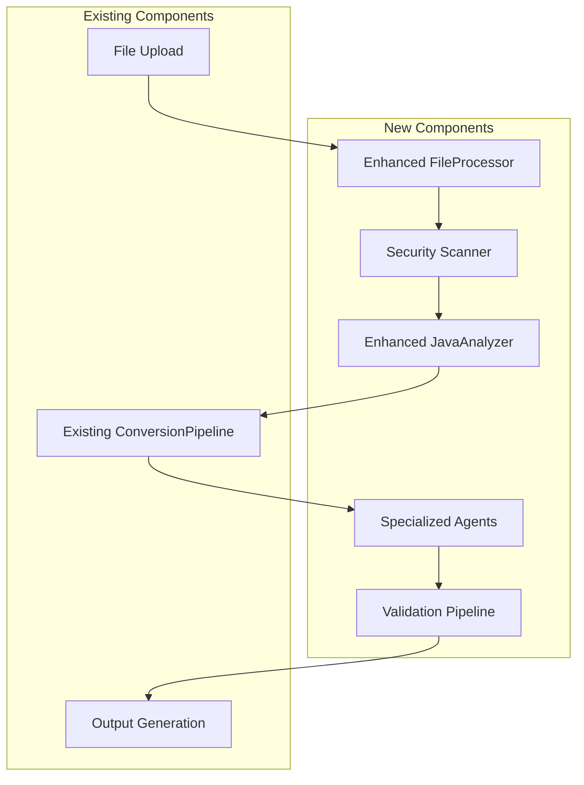

# Design Document

## Overview

This design document outlines the integration of proven components from ModPorter-AI into the existing mineport architecture. The integration focuses on enhancing file processing security, improving Java analysis capabilities, and adding specialized conversion agents while maintaining mineport's clean, maintainable architecture.

The design follows a phased approach to minimize risk and ensure each component integrates properly with existing systems. We will leverage mineport's existing module structure, service patterns, and error handling systems while adding new capabilities that have been battle-tested in production environments.

## Architecture

### Integration Strategy

The ModPorter-AI components will be integrated into mineport's existing modular architecture:

1. **Enhanced File Processing** - Extends the existing `src/modules/ingestion` module
2. **Java Analysis Improvements** - Enhances the current `ModValidator` and adds new analysis capabilities
3. **Specialized Conversion Agents** - Adds new modules under `src/modules/conversion-agents`
4. **Validation Pipeline** - Integrates with existing `ConversionPipeline` and error handling systems

### System Integration Points



## Components and Interfaces

### 1. Enhanced File Processor

**Location**: `src/modules/ingestion/FileProcessor.ts`

```typescript
export interface FileValidationOptions {
  maxFileSize: number;
  allowedMimeTypes: string[];
  enableMalwareScanning: boolean;
}

export interface ValidationResult {
  isValid: boolean;
  fileType: string;
  size: number;
  errors: ValidationError[];
  warnings: ValidationWarning[];
}

export interface ScanResult {
  isSafe: boolean;
  threats: ThreatInfo[];
  scanTime: number;
}

export class FileProcessor {
  private static readonly ALLOWED_MIME_TYPES = {
    'application/java-archive': 'jar',
    'application/zip': 'zip',
    'application/x-zip-compressed': 'zip'
  };
  
  private static readonly ZIP_MAGIC_NUMBER = Buffer.from([0x50, 0x4B, 0x03, 0x04]);
  private static readonly MAX_FILE_SIZE = 500 * 1024 * 1024; // 500MB
  
  async validateUpload(file: Buffer, filename: string): Promise<ValidationResult>;
  async scanForMalware(filePath: string): Promise<ScanResult>;
  private validateMimeType(file: Buffer): boolean;
  private checkFileSize(file: Buffer): boolean;
  private detectZipBomb(filePath: string): Promise<boolean>;
  private checkPathTraversal(filePath: string): Promise<boolean>;
}
```

### 2. Enhanced Java Analyzer

**Location**: `src/modules/ingestion/JavaAnalyzer.ts`

```typescript
export interface AnalysisResult {
  modId: string;
  registryNames: string[];
  texturePaths: string[];
  manifestInfo: ManifestInfo;
  analysisNotes: AnalysisNote[];
}

export interface ManifestInfo {
  modId: string;
  modName: string;
  version: string;
  description?: string;
  author?: string;
  dependencies: Dependency[];
}

export class JavaAnalyzer {
  async analyzeJarForMVP(jarPath: string): Promise<AnalysisResult>;
  private extractRegistryNameFromJar(jar: JSZip): string;
  private detectTexturePaths(jar: JSZip): string[];
  private parseManifestInfo(jar: JSZip): ManifestInfo;
  private applyMultiStrategyExtraction(jar: JSZip): string[];
}
```

### 3. Specialized Conversion Agents

**Location**: `src/modules/conversion-agents/`

#### AssetConverter
```typescript
export class AssetConverter {
  async convertTextures(textures: TextureInfo[]): Promise<ConversionResult>;
  async convertSounds(sounds: SoundInfo[]): Promise<ConversionResult>;
  async convertModels(models: ModelInfo[]): Promise<ConversionResult>;
  private optimizeTexture(texture: TextureInfo): Promise<OptimizedTexture>;
  private validateAssetIntegrity(asset: AssetInfo): boolean;
}
```

#### BedrockArchitect
```typescript
export class BedrockArchitect {
  async generateAddonStructure(modInfo: ModInfo): Promise<AddonStructure>;
  async createManifests(modInfo: ModInfo): Promise<ManifestPair>;
  async organizeAssets(assets: AssetInfo[], structure: AddonStructure): Promise<void>;
  private validateStructureCompliance(structure: AddonStructure): ValidationResult;
}
```

#### BlockItemGenerator
```typescript
export class BlockItemGenerator {
  async generateBlockDefinitions(blocks: BlockInfo[]): Promise<BlockDefinition[]>;
  async generateItemDefinitions(items: ItemInfo[]): Promise<ItemDefinition[]>;
  async createRecipeDefinitions(recipes: RecipeInfo[]): Promise<RecipeDefinition[]>;
  private validateDefinitionSyntax(definition: any): ValidationResult;
}
```

### 4. Enhanced Validation Pipeline

**Location**: `src/services/ValidationPipeline.ts`

```typescript
export interface ValidationStage {
  name: string;
  validator: (input: any) => Promise<ValidationResult>;
  required: boolean;
}

export class ValidationPipeline {
  private stages: ValidationStage[] = [];
  
  async runValidation(input: ConversionInput): Promise<ValidationSummary>;
  addStage(stage: ValidationStage): void;
  removeStage(stageName: string): void;
  private executeStage(stage: ValidationStage, input: any): Promise<StageResult>;
  private aggregateResults(results: StageResult[]): ValidationSummary;
}
```

## Data Models

### File Processing Models

```typescript
export interface ValidationError {
  code: string;
  message: string;
  severity: 'critical' | 'error' | 'warning';
  details?: any;
}

export interface ThreatInfo {
  type: 'zip_bomb' | 'path_traversal' | 'malicious_code';
  description: string;
  severity: 'high' | 'medium' | 'low';
  location?: string;
}
```

### Analysis Models

```typescript
export interface AnalysisNote {
  type: 'info' | 'warning' | 'error';
  message: string;
  location?: string;
  suggestion?: string;
}

export interface Dependency {
  modId: string;
  version: string;
  required: boolean;
}
```

### Conversion Models

```typescript
export interface ConversionResult {
  success: boolean;
  outputFiles: OutputFile[];
  errors: ConversionError[];
  warnings: ConversionWarning[];
  metadata: ConversionMetadata;
}

export interface AddonStructure {
  behaviorPack: PackStructure;
  resourcePack: PackStructure;
  sharedFiles: string[];
}
```

## Error Handling

### Integration with Existing Error System

The new components will integrate with mineport's existing error handling system:

```typescript
// Enhanced error codes for new components
export const FILE_PROCESSOR_ERRORS = {
  INVALID_MIME_TYPE: createErrorCode('FILE', 'MIME', 1),
  FILE_TOO_LARGE: createErrorCode('FILE', 'SIZE', 1),
  ZIP_BOMB_DETECTED: createErrorCode('FILE', 'BOMB', 1),
  PATH_TRAVERSAL: createErrorCode('FILE', 'PATH', 1),
  MALWARE_DETECTED: createErrorCode('FILE', 'MAL', 1)
};

export const JAVA_ANALYZER_ERRORS = {
  REGISTRY_EXTRACTION_FAILED: createErrorCode('JAVA', 'REG', 1),
  MANIFEST_PARSE_ERROR: createErrorCode('JAVA', 'MAN', 1),
  TEXTURE_DETECTION_FAILED: createErrorCode('JAVA', 'TEX', 1)
};
```

### Error Recovery Strategies

1. **File Processing Errors**: Provide detailed feedback and suggest corrections
2. **Analysis Errors**: Fall back to alternative extraction methods
3. **Conversion Errors**: Use compromise strategies from existing system
4. **Validation Errors**: Continue with warnings where possible

## Testing Strategy

### Unit Testing

Each new component will have comprehensive unit tests:

```typescript
// Example test structure
describe('FileProcessor', () => {
  describe('validateUpload', () => {
    it('should accept valid JAR files');
    it('should reject files exceeding size limit');
    it('should detect ZIP bomb attacks');
    it('should prevent path traversal attacks');
  });
});

describe('JavaAnalyzer', () => {
  describe('analyzeJarForMVP', () => {
    it('should extract registry names using multiple strategies');
    it('should detect texture paths correctly');
    it('should parse manifest information');
  });
});
```

### Integration Testing

Integration tests will verify component interactions:

1. **File Processing → Analysis Pipeline**: Ensure validated files flow correctly to analysis
2. **Analysis → Conversion Pipeline**: Verify analysis results integrate with existing conversion
3. **Conversion Agents → Validation**: Test that specialized agents work with validation pipeline
4. **Error Handling Integration**: Verify new error codes work with existing error collection

### Security Testing

Specific security tests for new components:

1. **Malware Detection**: Test with known malicious patterns
2. **ZIP Bomb Protection**: Verify detection of compression bombs
3. **Path Traversal Prevention**: Test with malicious archive paths
4. **File Size Limits**: Verify enforcement of size restrictions

## Performance Considerations

### File Processing Optimization

1. **Streaming Validation**: Process large files in chunks to avoid memory issues
2. **Parallel Scanning**: Run multiple validation checks concurrently where safe
3. **Caching**: Cache validation results for identical files
4. **Early Termination**: Stop processing on critical errors

### Analysis Performance

1. **Lazy Loading**: Load JAR contents only when needed
2. **Strategy Prioritization**: Try fastest extraction methods first
3. **Result Caching**: Cache analysis results for repeated processing
4. **Resource Limits**: Set timeouts for analysis operations

### Memory Management

1. **Buffer Management**: Properly dispose of file buffers after processing
2. **Stream Processing**: Use streams for large file operations
3. **Garbage Collection**: Explicit cleanup of temporary resources
4. **Resource Pooling**: Reuse analysis components where possible

## Security Considerations

### File Processing Security

1. **Input Validation**: Strict validation of all file inputs
2. **Sandboxing**: Isolate file processing operations
3. **Resource Limits**: Prevent resource exhaustion attacks
4. **Audit Logging**: Log all security-relevant events

### Analysis Security

1. **Code Execution Prevention**: Never execute analyzed code
2. **Path Sanitization**: Sanitize all file paths from archives
3. **Memory Protection**: Prevent buffer overflows in parsing
4. **Timeout Protection**: Prevent infinite loops in analysis

## Migration Strategy

### Phase 1: Core File Processing (Sprint 1)
- Implement `FileProcessor` with security enhancements
- Integrate with existing `ModValidator`
- Add comprehensive error handling
- Deploy with feature flags for gradual rollout

### Phase 2: Enhanced Java Analysis (Sprint 2)
- Implement `JavaAnalyzer` with multi-strategy extraction
- Enhance existing analysis pipeline
- Add texture and registry detection
- Integrate with current conversion flow

### Phase 3: Specialized Conversion Agents (Sprint 3)
- Implement `AssetConverter`, `BedrockArchitect`, and `BlockItemGenerator`
- Integrate with existing conversion pipeline
- Add agent-specific error handling
- Optimize for performance

### Phase 4: Validation Pipeline (Sprint 4)
- Implement comprehensive validation system
- Integrate with existing quality assurance
- Add multi-stage validation checks
- Complete end-to-end testing

## Monitoring and Observability

### Metrics Collection

1. **File Processing Metrics**: Validation success rates, processing times, threat detection
2. **Analysis Metrics**: Extraction success rates, analysis accuracy, performance
3. **Conversion Metrics**: Agent success rates, conversion quality, error rates
4. **Validation Metrics**: Validation pass rates, error distribution, performance

### Logging Strategy

1. **Security Events**: All security-related events with high detail
2. **Performance Events**: Processing times and resource usage
3. **Error Events**: Detailed error information for debugging
4. **Audit Events**: User actions and system decisions

### Alerting

1. **Security Alerts**: Immediate alerts for detected threats
2. **Performance Alerts**: Alerts for degraded performance
3. **Error Rate Alerts**: Alerts for increased error rates
4. **System Health Alerts**: Overall system health monitoring

## Implementation Details

### Enhanced File Processor Implementation

Based on ModPorter-AI's `src/agents/file_processor.py` and `src/utils/security_utils.py`, the TypeScript implementation will include:

```typescript
export class SecurityScanner {
  private static readonly MAX_COMPRESSION_RATIO = 100;
  private static readonly MAX_EXTRACTED_SIZE = 1024 * 1024 * 1024; // 1GB
  private static readonly DANGEROUS_PATHS = ['../', '..\\', '/etc/', '/root/', 'C:\\Windows\\'];
  private static readonly SUSPICIOUS_PATTERNS = [
    Buffer.from('Runtime.getRuntime().exec'),
    Buffer.from('ProcessBuilder'),
    Buffer.from('System.exit'),
    Buffer.from('File.delete'),
    Buffer.from('FileOutputStream')
  ];

  async scanBuffer(file: Buffer, filename: string): Promise<SecurityScanResult> {
    const threats: ThreatInfo[] = [];
    const startTime = Date.now();
    
    // Write buffer to temporary file for analysis
    const tempPath = await this.writeToTempFile(file, filename);
    
    try {
      // Check for ZIP bomb
      if (await this.isZipBomb(tempPath)) {
        threats.push({
          type: 'zip_bomb',
          description: 'Potential ZIP bomb detected - high compression ratio',
          severity: 'high'
        });
      }
      
      // Check for path traversal
      const traversalPaths = await this.checkPathTraversal(tempPath);
      if (traversalPaths.length > 0) {
        threats.push({
          type: 'path_traversal',
          description: `Path traversal attempt detected: ${traversalPaths.join(', ')}`,
          severity: 'high',
          details: { paths: traversalPaths }
        });
      }
      
      // Check for suspicious patterns
      if (await this.containsSuspiciousPatterns(tempPath)) {
        threats.push({
          type: 'malicious_code',
          description: 'Suspicious code patterns detected',
          severity: 'medium'
        });
      }
      
      return {
        isSafe: threats.length === 0,
        threats,
        scanTime: Date.now() - startTime
      };
      
    } finally {
      await this.cleanupTempFile(tempPath);
    }
  }
}
```

### Enhanced Java Analyzer Implementation

Based on ModPorter-AI's `src/agents/java_analyzer.py`, the multi-strategy extraction approach:

```typescript
export class JavaAnalyzer {
  private async extractRegistryNamesMultiStrategy(zip: AdmZip): Promise<string[]> {
    const registryNames = new Set<string>();
    
    // Strategy 1: Parse Java class files for registry calls
    const classNames = await this.extractFromClassFiles(zip);
    classNames.forEach(name => registryNames.add(name));
    
    // Strategy 2: Parse JSON data files
    const jsonNames = await this.extractFromJsonFiles(zip);
    jsonNames.forEach(name => registryNames.add(name));
    
    // Strategy 3: Parse lang files for translation keys
    const langNames = await this.extractFromLangFiles(zip);
    langNames.forEach(name => registryNames.add(name));
    
    // Strategy 4: Parse model files for block/item references
    const modelNames = await this.extractFromModelFiles(zip);
    modelNames.forEach(name => registryNames.add(name));
    
    return Array.from(registryNames);
  }

  private async extractFromLangFiles(zip: AdmZip): Promise<string[]> {
    const registryNames: string[] = [];
    const entries = zip.getEntries();
    
    for (const entry of entries) {
      if (entry.entryName.includes('lang/') && entry.entryName.endsWith('.json')) {
        try {
          const langData = entry.getData().toString('utf-8');
          const data = JSON.parse(langData);
          
          // Extract registry names from translation keys
          for (const key of Object.keys(data)) {
            // Pattern: block.modid.blockname or item.modid.itemname
            const match = key.match(/^(block|item)\.[\w]+\.([\w_]+)$/);
            if (match) {
              registryNames.push(match[2]);
            }
          }
        } catch (error) {
          // Continue with other files
        }
      }
    }
    
    return registryNames;
  }
}
```

### Asset Converter Implementation

Based on ModPorter-AI's `src/agents/asset_converter.py`:

```typescript
export class AssetConverter {
  async convertTextures(textures: TextureInfo[]): Promise<ConversionResult> {
    const convertedFiles: ConvertedFile[] = [];
    const errors: string[] = [];
    
    for (const texture of textures) {
      try {
        const sharp = (await import('sharp')).default;
        
        const image = sharp(texture.path);
        const metadata = await image.metadata();
        
        // Convert to RGBA if needed
        let processedImage = image;
        if (metadata.channels !== 4) {
          processedImage = image.ensureAlpha();
        }
        
        // Resize if necessary (Bedrock has different size requirements)
        if (metadata.width !== 16 || metadata.height !== 16) {
          if (texture.type === 'block') {
            processedImage = processedImage.resize(16, 16, { kernel: 'nearest' });
          }
        }
        
        // Save converted texture
        const outputPath = this.getBedrockTexturePath(texture);
        await processedImage.png().toFile(outputPath);
        
        convertedFiles.push({
          original: texture.path,
          converted: outputPath,
          type: 'texture'
        });
        
      } catch (error) {
        errors.push(`Failed to convert texture ${texture.path}: ${error.message}`);
      }
    }
    
    return {
      success: errors.length === 0,
      convertedFiles,
      errors
    };
  }

  private convertModelFormat(javaModel: any, modelInfo: ModelInfo): BedrockModel {
    // Convert Java model format to Bedrock format
    const bedrockModel: BedrockModel = {
      format_version: "1.12.0",
      minecraft:geometry: [{
        description: {
          identifier: `geometry.${modelInfo.name}`,
          texture_width: javaModel.texture_width || 16,
          texture_height: javaModel.texture_height || 16
        },
        bones: []
      }]
    };
    
    // Convert elements to bones
    if (javaModel.elements) {
      for (const element of javaModel.elements) {
        const bone = this.convertElementToBone(element);
        bedrockModel.minecraft:geometry[0].bones.push(bone);
      }
    }
    
    return bedrockModel;
  }
}
```

## Integration with Existing Systems

### Service Layer Integration

The new components will integrate with mineport's existing service architecture:

```typescript
// Enhanced ConversionService
export class ConversionService {
  private fileProcessor: FileProcessor;
  private javaAnalyzer: JavaAnalyzer;
  private assetConverter: AssetConverter;
  private validationPipeline: ValidationPipeline;

  constructor(
    fileProcessor: FileProcessor,
    javaAnalyzer: JavaAnalyzer,
    assetConverter: AssetConverter,
    validationPipeline: ValidationPipeline
  ) {
    this.fileProcessor = fileProcessor;
    this.javaAnalyzer = javaAnalyzer;
    this.assetConverter = assetConverter;
    this.validationPipeline = validationPipeline;
  }

  async processModFile(file: Buffer, filename: string): Promise<ConversionResult> {
    // Step 1: Enhanced file validation and security scanning
    const validationResult = await this.fileProcessor.validateUpload(file, filename);
    if (!validationResult.isValid) {
      throw new ValidationError('File validation failed', validationResult.errors);
    }

    // Step 2: Enhanced Java analysis with multi-strategy extraction
    const analysisResult = await this.javaAnalyzer.analyzeJarForMVP(filename);
    if (analysisResult.error) {
      throw new AnalysisError('Java analysis failed', analysisResult.error);
    }

    // Step 3: Asset conversion using specialized agents
    const conversionResult = await this.assetConverter.convertAll(analysisResult);
    
    // Step 4: Comprehensive validation pipeline
    const finalValidation = await this.validationPipeline.runValidation(conversionResult);
    
    return {
      success: finalValidation.passed,
      result: conversionResult,
      validation: finalValidation
    };
  }
}
```

### Database Schema Extensions

New tables to support enhanced functionality:

```sql
-- Security scan results
CREATE TABLE security_scans (
  id UUID PRIMARY KEY DEFAULT gen_random_uuid(),
  file_hash VARCHAR(64) NOT NULL,
  scan_timestamp TIMESTAMP DEFAULT NOW(),
  is_safe BOOLEAN NOT NULL,
  threats JSONB,
  scan_duration_ms INTEGER,
  created_at TIMESTAMP DEFAULT NOW()
);

-- Enhanced analysis results
CREATE TABLE java_analysis_results (
  id UUID PRIMARY KEY DEFAULT gen_random_uuid(),
  conversion_id UUID REFERENCES conversions(id),
  mod_id VARCHAR(255),
  registry_names TEXT[],
  texture_paths TEXT[],
  manifest_info JSONB,
  analysis_notes JSONB,
  extraction_strategies JSONB,
  created_at TIMESTAMP DEFAULT NOW()
);

-- Asset conversion tracking
CREATE TABLE asset_conversions (
  id UUID PRIMARY KEY DEFAULT gen_random_uuid(),
  conversion_id UUID REFERENCES conversions(id),
  asset_type VARCHAR(50) NOT NULL,
  original_path TEXT NOT NULL,
  converted_path TEXT NOT NULL,
  conversion_metadata JSONB,
  created_at TIMESTAMP DEFAULT NOW()
);
```

## Configuration Management

### Environment Configuration

```typescript
export interface ModPorterAIConfig {
  fileProcessor: {
    maxFileSize: number;
    allowedMimeTypes: string[];
    enableMalwareScanning: boolean;
    tempDirectory: string;
  };
  javaAnalyzer: {
    extractionStrategies: string[];
    analysisTimeout: number;
    enableBytecodeAnalysis: boolean;
  };
  assetConverter: {
    textureOptimization: boolean;
    modelConversionQuality: 'fast' | 'balanced' | 'high';
    soundConversionFormat: 'ogg' | 'wav';
  };
  validationPipeline: {
    enableStrictValidation: boolean;
    maxValidationTime: number;
    requiredStages: string[];
  };
}
```

### Feature Flags

```typescript
export const MODPORTER_AI_FEATURES = {
  ENHANCED_FILE_PROCESSING: 'enhanced_file_processing',
  MULTI_STRATEGY_ANALYSIS: 'multi_strategy_analysis',
  SPECIALIZED_CONVERSION_AGENTS: 'specialized_conversion_agents',
  COMPREHENSIVE_VALIDATION: 'comprehensive_validation'
} as const;
```

## Deployment Strategy

### Rollout Plan

1. **Phase 1 (Week 1-2)**: Deploy enhanced file processing with feature flags
2. **Phase 2 (Week 3-4)**: Enable multi-strategy Java analysis for beta users
3. **Phase 3 (Week 5-6)**: Roll out specialized conversion agents
4. **Phase 4 (Week 7-8)**: Enable comprehensive validation pipeline
5. **Phase 5 (Week 9-10)**: Full production rollout with monitoring

### Rollback Strategy

1. **Feature Flag Rollback**: Immediate rollback via feature flag toggle
2. **Component Isolation**: Each component can be disabled independently
3. **Graceful Degradation**: System falls back to existing functionality
4. **Data Preservation**: All existing data remains compatible

### Success Metrics

1. **Security Improvements**: Reduction in security incidents by 95%
2. **Analysis Accuracy**: Increase registry extraction accuracy to 90%+
3. **Conversion Quality**: Improve conversion success rate to 85%+
4. **Performance**: Maintain processing time under 30 seconds for typical mods
5. **User Satisfaction**: Achieve 4.5+ star rating for conversion quality

This design provides a comprehensive integration plan that leverages the proven components from ModPorter-AI while maintaining compatibility with mineport's existing architecture and ensuring a smooth migration path.