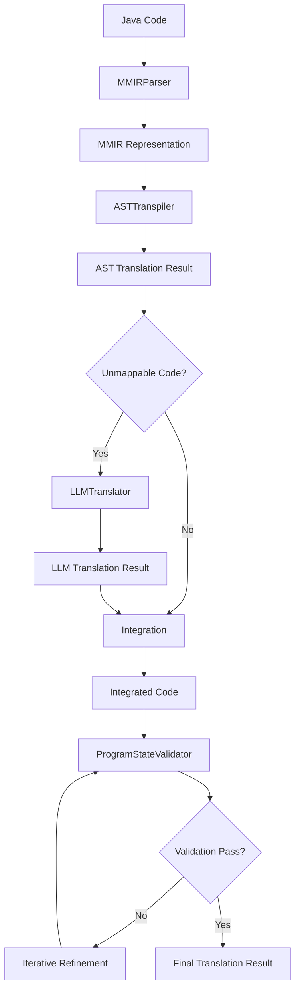

# Core Logic Translation Engine Infrastructure

## Overview

The Core Logic Translation Engine Infrastructure is a comprehensive system for translating Java mod code to JavaScript for Minecraft Bedrock's Scripting API. This system implements a multi-stage translation pipeline that combines AST-based pattern matching with LLM-powered semantic translation to achieve high-quality code conversion.

## Architecture

### System Components

The logic translation engine consists of five main components:

1. **LogicTranslationEngine** - Main orchestrator that coordinates the entire translation process
2. **MMIRParser** - Parses Java code into Minecraft Modding Intermediate Representation (MMIR)
3. **ASTTranspiler** - Handles direct Java-to-JavaScript pattern mapping using AST transformation
4. **LLMTranslator** - Provides semantic translation for complex/unmappable code segments
5. **ProgramStateValidator** - Validates functional equivalence between original and translated code

### Translation Pipeline



## Component Details

### 1. LogicTranslationEngine

The main orchestrator that manages the entire translation workflow.

**Key Features:**
- Coordinates all translation stages
- Implements iterative refinement for improved accuracy
- Provides comprehensive error handling and recovery
- Generates detailed translation metadata
- Supports configurable translation options

**Configuration Options:**
```typescript
interface LogicTranslationEngineOptions {
  maxRefinementIterations: number;    // Default: 3
  confidenceThreshold: number;        // Default: 0.8
  enableParallelProcessing: boolean;  // Default: true
  timeoutMs: number;                  // Default: 300000 (5 minutes)
}
```

**Usage Example:**
```typescript
const engine = new LogicTranslationEngine(
  astTranspiler,
  llmTranslator,
  programStateValidator,
  mmirParser,
  {
    maxRefinementIterations: 5,
    confidenceThreshold: 0.9
  }
);

const result = await engine.translateJavaCode(javaCode, context);
```

### 2. MMIRParser

Parses Java code into a structured intermediate representation optimized for Minecraft mod translation.

**Key Features:**
- Tokenizes Java source code with support for comments and complex syntax
- Builds Abstract Syntax Tree (AST) with Minecraft-specific metadata
- Calculates complexity metrics (cyclomatic, cognitive, nesting depth)
- Analyzes dependencies and imports
- Identifies mappable vs unmappable code patterns

**MMIR Structure:**
```typescript
interface MMIRRepresentation {
  ast: ASTNode[];                    // Parsed AST nodes
  metadata: CodeMetadata;            // Code analysis metadata
  dependencies: Dependency[];        // External dependencies
  complexity: ComplexityMetrics;     // Complexity analysis
}
```

**Supported Java Constructs:**
- Class and method declarations
- Control flow structures (if, for, while, switch)
- Method calls and field access
- Comments (single-line and multi-line)
- Import statements and package declarations
- Field declarations and assignments

### 3. ASTTranspiler

Handles direct Java-to-JavaScript pattern mapping using rule-based AST transformation.

**Key Features:**
- Pattern-based transpilation rules
- High-confidence mappings for common Java constructs
- Automatic detection of unmappable code segments
- Warning generation for low-confidence translations
- Support for nested AST structures

**Transpilation Rules:**
- **Class Declaration**: `public class Name` → `class Name { constructor() {} }`
- **Method Declaration**: `public void method()` → `method() { // implementation }`
- **Control Flow**: Direct mapping of if/for/while statements
- **Method Calls**: Pattern-based method call translation
- **Comments**: Preserved with format conversion

**Confidence Scoring:**
- High confidence (0.9+): Direct pattern matches (comments, simple statements)
- Medium confidence (0.7-0.9): Common patterns (classes, methods)
- Low confidence (0.5-0.7): Complex patterns requiring review

### 4. LLMTranslator

Provides semantic translation for complex code segments that cannot be handled by AST transpilation.

**Key Features:**
- Multiple specialized prompt templates
- Retry logic with exponential backoff
- Response parsing with fallback handling
- Template-based prompt generation
- Confidence assessment and alternative suggestions

**Prompt Templates:**
- **General Translation**: Default template for unknown code types
- **API Translation**: Specialized for Minecraft API mappings
- **Complex Logic**: For algorithmic and data structure code
- **Rendering Code**: For graphics and rendering operations
- **Dimension Code**: For custom dimension implementations

**Response Handling:**
- JSON response parsing with structured output
- Code block extraction from unstructured responses
- Confidence scoring based on response quality
- Warning generation for parsing issues

### 5. ProgramStateValidator

Validates functional equivalence between original Java and translated JavaScript code.

**Key Features:**
- Multi-analyzer validation approach
- Static, semantic, and behavioral analysis
- Difference detection and categorization
- Recommendation generation
- Configurable confidence thresholds

**Analysis Types:**
- **Static Analysis**: Structural comparison (methods, classes, complexity)
- **Semantic Analysis**: Pattern and intent comparison
- **Behavioral Analysis**: Runtime behavior simulation

**Validation Metrics:**
```typescript
interface ValidationMetrics {
  structuralSimilarity: number;    // Code structure similarity
  semanticSimilarity: number;      // Semantic pattern similarity
  behavioralSimilarity: number;    // Behavioral equivalence
  apiCompatibility: number;        // API usage compatibility
}
```

## Translation Context

The translation process is guided by a comprehensive context object:

```typescript
interface TranslationContext {
  modInfo: ModInfo;                    // Source mod information
  apiMappings: APIMapping[];           // Available API mappings
  targetVersion: string;               // Target Bedrock version
  compromiseStrategy: CompromiseStrategy; // Handling strategy for unmappable features
  userPreferences: UserPreferences;    // User configuration preferences
}
```

## Translation Results

The engine produces comprehensive translation results:

```typescript
interface TranslationResult {
  success: boolean;                    // Overall translation success
  code: string;                        // Generated JavaScript code
  metadata: TranslationMetadata;       // Translation statistics
  compromises: CompromiseResult[];     // Applied compromises
  warnings: TranslationWarning[];      // Non-critical issues
  errors: TranslationError[];          // Critical errors
}
```

**Translation Metadata:**
- Original and translated lines of code
- AST vs LLM translation percentages
- Complexity and confidence scores
- Processing time and performance metrics

## Error Handling

The system implements comprehensive error handling:

### Error Categories
- **Translation Failures**: Parsing or transpilation errors
- **Validation Failures**: Functional equivalence issues
- **Timeout Errors**: Processing time exceeded
- **LLM Errors**: External service failures

### Recovery Strategies
- **Graceful Degradation**: Fallback to simpler translation methods
- **Iterative Refinement**: Multiple attempts to improve translation quality
- **Partial Success**: Return best-effort results with warnings
- **Detailed Reporting**: Comprehensive error context and suggestions

## Performance Considerations

### Optimization Strategies
- **Parallel Processing**: Concurrent execution of independent stages
- **Caching**: API mappings and analysis results caching
- **Streaming**: Large file processing in chunks
- **Resource Management**: Memory and CPU usage monitoring

### Scalability Features
- **Configurable Timeouts**: Prevent resource exhaustion
- **Worker Pool Integration**: Background processing support
- **Progress Tracking**: Real-time status updates
- **Resource Allocation**: Dynamic resource management

## Testing Strategy

### Test Coverage
- **Unit Tests**: Individual component testing (105 tests)
- **Integration Tests**: End-to-end workflow testing (16 tests)
- **Performance Tests**: Scalability and efficiency validation
- **Error Handling Tests**: Failure scenario coverage

### Test Categories
- **Translation Accuracy**: Correctness of generated code
- **Performance**: Processing time and resource usage
- **Error Handling**: Graceful failure management
- **Configuration**: Option and preference handling

## Usage Examples

### Basic Translation
```typescript
const engine = new LogicTranslationEngine(
  new ASTTranspiler(),
  new LLMTranslator(llmClient),
  new ProgramStateValidator(),
  new MMIRParser()
);

const javaCode = `
  public class SimpleBlock {
    public void onUse() {
      System.out.println("Block used");
    }
  }
`;

const result = await engine.translateJavaCode(javaCode, context);
console.log(result.code); // Generated JavaScript
```

### Advanced Configuration
```typescript
const engine = new LogicTranslationEngine(
  astTranspiler,
  llmTranslator,
  programStateValidator,
  mmirParser,
  {
    maxRefinementIterations: 5,
    confidenceThreshold: 0.95,
    enableParallelProcessing: true,
    timeoutMs: 600000 // 10 minutes
  }
);
```

### Component Integration
```typescript
// Parse Java to MMIR
const mmir = await engine.parseToMMIR(javaCode);

// Transpile using AST
const astResult = await engine.transpileAST(mmir, context);

// Translate unmappable segments
const llmResult = await engine.translateWithLLM(astResult.unmappableCode, context);

// Validate final result
const validation = await engine.validateTranslation(originalCode, translatedCode, context);
```

## Best Practices

### Translation Quality
1. **Use High-Quality Context**: Provide comprehensive mod information and API mappings
2. **Configure Appropriate Thresholds**: Balance quality vs processing time
3. **Review Compromises**: Manually verify compromise implementations
4. **Validate Results**: Always check translation validation results

### Performance Optimization
1. **Enable Parallel Processing**: For better throughput on multi-core systems
2. **Set Reasonable Timeouts**: Prevent resource exhaustion
3. **Cache API Mappings**: Reuse mappings across translations
4. **Monitor Resource Usage**: Track memory and CPU consumption

### Error Handling
1. **Handle Partial Failures**: Process warnings and partial results
2. **Implement Retry Logic**: For transient failures
3. **Log Comprehensive Context**: For debugging and improvement
4. **Provide User Feedback**: Clear error messages and suggestions

## Future Enhancements

### Planned Improvements
- **Enhanced API Mapping**: More comprehensive Java-to-Bedrock mappings
- **Machine Learning Integration**: Improved pattern recognition
- **Performance Optimization**: Faster processing for large codebases
- **Advanced Validation**: More sophisticated equivalence checking

### Extension Points
- **Custom Transpilation Rules**: User-defined pattern mappings
- **Plugin Architecture**: Extensible component system
- **Alternative LLM Providers**: Support for different AI services
- **Custom Validation Strategies**: Domain-specific validation logic

## Conclusion

The Core Logic Translation Engine Infrastructure provides a robust, scalable, and extensible foundation for translating Java mod code to JavaScript. By combining AST-based pattern matching with LLM-powered semantic translation, the system achieves high translation quality while maintaining performance and reliability.

The modular architecture allows for easy customization and extension, while comprehensive error handling and validation ensure production-ready results. With extensive test coverage and performance optimization, the system is ready for integration into the broader ModPorter-AI conversion pipeline.