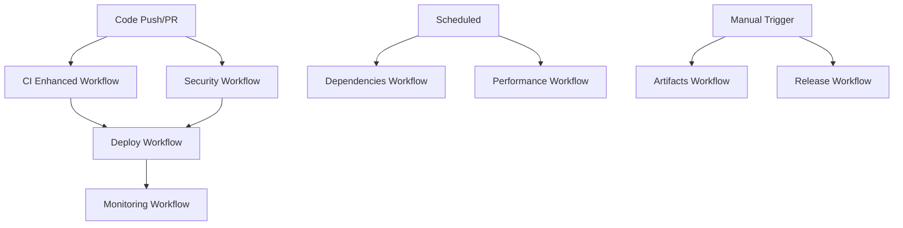

# Enhanced CI/CD Pipeline Guide

## Overview

This guide provides comprehensive documentation for the enhanced GitHub Actions CI/CD pipeline implemented for the ModPorter-AI project. The enhanced pipeline provides advanced automation, security scanning, performance monitoring, and deployment capabilities.

## Table of Contents

1. [Pipeline Architecture](#pipeline-architecture)
2. [Workflow Components](#workflow-components)
3. [Getting Started](#getting-started)
4. [Configuration](#configuration)
5. [Monitoring and Alerting](#monitoring-and-alerting)
6. [Troubleshooting](#troubleshooting)
7. [Best Practices](#best-practices)
8. [Migration Guide](#migration-guide)

## Pipeline Architecture

The enhanced CI/CD pipeline consists of multiple specialized workflows:



### Core Workflows

#### 1. CI Enhanced Workflow (`.github/workflows/ci-enhanced.yml`)
- **Purpose**: Main continuous integration pipeline
- **Triggers**: Push to main, pull requests
- **Features**:
  - Matrix builds across Node.js versions (18.x, 20.x, 22.x)
  - Multi-OS testing (Ubuntu, macOS, Windows)
  - Parallel test execution
  - Intelligent caching
  - Coverage reporting

#### 2. Security Workflow (`.github/workflows/security.yml`)
- **Purpose**: Comprehensive security scanning
- **Triggers**: Push, pull requests, scheduled
- **Features**:
  - CodeQL static analysis
  - Dependency vulnerability scanning
  - Secret detection
  - Security reporting

#### 3. Deploy Workflow (`.github/workflows/deploy.yml`)
- **Purpose**: Automated deployment pipeline
- **Triggers**: Main branch merge, manual dispatch
- **Features**:
  - Environment-specific deployments
  - Canary deployment strategy
  - Health checks and rollback
  - Integration with existing deployment scripts

#### 4. Dependencies Workflow (`.github/workflows/dependencies.yml`)
- **Purpose**: Automated dependency management
- **Triggers**: Scheduled (weekly)
- **Features**:
  - Dependency update detection
  - Security patch prioritization
  - Automated pull request creation
  - Conflict resolution guidance

#### 5. Performance Workflow (`.github/workflows/performance.yml`)
- **Purpose**: Performance monitoring and regression testing
- **Triggers**: Scheduled, manual dispatch
- **Features**:
  - Performance benchmark execution
  - Regression detection
  - Performance reporting

#### 6. Monitoring Workflow (`.github/workflows/monitoring.yml`)
- **Purpose**: Pipeline health monitoring
- **Triggers**: Workflow completion events
- **Features**:
  - Metrics collection
  - Alert generation
  - Dashboard updates

## Workflow Components

### Matrix Build Configuration

The CI workflow uses matrix builds to ensure compatibility across different environments:

```yaml
strategy:
  matrix:
    node-version: [18.x, 20.x, 22.x]
    os: [ubuntu-latest, macos-latest, windows-latest]
    include:
      - os: ubuntu-latest
        node-version: 20.x
        coverage: true
```

### Caching Strategy

Intelligent caching is implemented at multiple levels:

1. **Dependency Caching**:
   ```yaml
   - uses: actions/cache@v3
     with:
       path: ~/.npm
       key: ${{ runner.os }}-node-${{ hashFiles('**/package-lock.json') }}
   ```

2. **Build Caching**:
   ```yaml
   - uses: actions/cache@v3
     with:
       path: dist
       key: ${{ runner.os }}-build-${{ github.sha }}
   ```

3. **Test Caching**:
   ```yaml
   - uses: actions/cache@v3
     with:
       path: coverage
       key: ${{ runner.os }}-coverage-${{ github.sha }}
   ```

### Security Scanning

The security workflow implements multiple scanning layers:

1. **Static Code Analysis (CodeQL)**:
   ```yaml
   - uses: github/codeql-action/init@v2
     with:
       languages: javascript, typescript
   ```

2. **Dependency Scanning (npm audit)**:
   ```yaml
   - name: Enhanced npm audit
     run: |
       npm audit --json > npm-audit-raw.json
       node scripts/generate-sarif-from-npm-audit.js
   ```

3. **Secret Scanning (GitLeaks)**:
   ```yaml
   - uses: zricethezav/gitleaks-action@master
   ```

## Getting Started

### Prerequisites

1. **Repository Setup**:
    - Ensure all workflow files are in `.github/workflows/`
    - Configure repository secrets and variables
    - Set up branch protection rules

2. **Required Secrets**:
   ```
   # No external tokens needed - using free npm audit
   SLACK_WEBHOOK_URL   # For notifications
   DEPLOY_KEY          # For deployment access
   ```

3. **Required Variables**:
   ```
   NODE_VERSION        # Default Node.js version
   COVERAGE_THRESHOLD  # Minimum coverage percentage
   PERFORMANCE_BUDGET  # Performance thresholds
   ```

### Initial Setup

1. **Clone the repository**:
   ```bash
   git clone <repository-url>
   cd modporter-ai
   ```

2. **Install dependencies**:
   ```bash
   npm install
   ```

3. **Run local validation**:
   ```bash
   npm run validate:pipeline
   ```

4. **Create a test pull request** to trigger the enhanced CI pipeline

### First Run Checklist

- [ ] All workflow files are present and valid
- [ ] Repository secrets are configured
- [ ] Branch protection rules are enabled
- [ ] Test pull request triggers all workflows
- [ ] Security scans complete successfully
- [ ] Performance benchmarks establish baseline

## Configuration

### Environment Variables

The pipeline uses environment variables for configuration:

```yaml
env:
  NODE_VERSION: '20.x'
  COVERAGE_THRESHOLD: 80
  PERFORMANCE_BUDGET: 5000
  CACHE_VERSION: v1
  SECURITY_SCAN_LEVEL: high
```

### Workflow Customization

#### Modifying Matrix Builds

To add or remove Node.js versions:

```yaml
strategy:
  matrix:
    node-version: [18.x, 20.x, 22.x, 21.x]  # Add 21.x
```

#### Adjusting Security Thresholds

To change vulnerability severity thresholds:

```yaml
- name: Run npm audit
  run: npm audit --audit-level=medium  # Using free npm audit
```

#### Customizing Performance Budgets

Update performance thresholds in the performance workflow:

```yaml
env:
  BUILD_TIME_BUDGET: 120000  # 2 minutes in milliseconds
  TEST_TIME_BUDGET: 60000    # 1 minute in milliseconds
```

### Integration with Existing Scripts

The pipeline integrates with existing deployment and validation scripts:

1. **Deployment Integration**:
   ```yaml
   - name: Deploy to Staging
     run: ./scripts/deploy-modporter-ai.sh staging
   ```

2. **Validation Integration**:
   ```yaml
   - name: Validate Deployment
     run: node scripts/validate-deployment.js
   ```

3. **Health Check Integration**:
   ```yaml
   - name: Health Check
     run: curl -f http://localhost:3000/health
   ```

## Monitoring and Alerting

### Metrics Collection

The pipeline collects comprehensive metrics:

1. **Build Metrics**:
    - Build duration
    - Success/failure rates
    - Cache hit rates
    - Resource utilization

2. **Test Metrics**:
    - Test execution time
    - Coverage percentages
    - Flaky test detection
    - Test reliability scores

3. **Deployment Metrics**:
    - Deployment frequency
    - Lead time for changes
    - Mean time to recovery
    - Change failure rate

### Alert Configuration

Alerts are configured for various scenarios:

1. **Build Failures**:
   ```yaml
   - name: Notify Build Failure
     if: failure()
     uses: 8398a7/action-slack@v3
     with:
       status: failure
       webhook_url: ${{ secrets.SLACK_WEBHOOK_URL }}
   ```

2. **Security Vulnerabilities**:
   ```yaml
   - name: Security Alert
     if: steps.security-scan.outputs.vulnerabilities > 0
     run: |
       echo "High severity vulnerabilities found"
       exit 1
   ```

3. **Performance Degradation**:
   ```yaml
   - name: Performance Alert
     if: steps.performance-test.outputs.regression == 'true'
     run: |
       echo "Performance regression detected"
       # Send alert but don't fail the build
   ```

### Dashboard Integration

The pipeline integrates with monitoring dashboards:

1. **GitHub Actions Dashboard**: Built-in workflow monitoring
2. **Custom Metrics Dashboard**: Integration with existing monitoring systems
3. **Security Dashboard**: Vulnerability tracking and compliance reporting

## Troubleshooting

### Common Issues

#### 1. Build Failures

**Symptom**: Build fails with compilation errors
**Solution**:
```bash
# Check TypeScript configuration
npx tsc --noEmit

# Verify dependencies
npm audit
npm install

# Clear cache if needed
npm run clean
```

#### 2. Test Failures

**Symptom**: Tests fail intermittently
**Solution**:
```bash
# Run tests locally
npm test

# Check for flaky tests
npm run test:flaky

# Update test snapshots if needed
npm run test:update-snapshots
```

#### 3. Security Scan Failures

**Symptom**: Security scans block deployment
**Solution**:
```bash
# Run security scan locally
npm audit --audit-level high

# Fix vulnerabilities
npm audit fix

# Check for secrets
git secrets --scan
```

#### 4. Deployment Failures

**Symptom**: Deployment fails health checks
**Solution**:
```bash
# Check deployment logs
kubectl logs deployment/modporter-ai

# Validate configuration
node scripts/validate-deployment.js

# Test health endpoints
curl -f http://localhost:3000/health
```

#### 5. Cache Issues

**Symptom**: Builds are slow despite caching
**Solution**:
```bash
# Clear GitHub Actions cache
gh cache delete --all

# Verify cache keys in workflow
# Check cache hit rates in logs
```

### Debug Mode

Enable debug logging for troubleshooting:

```yaml
env:
  ACTIONS_STEP_DEBUG: true
  ACTIONS_RUNNER_DEBUG: true
```

### Log Analysis

Key log locations and what to look for:

1. **Build Logs**: Compilation errors, dependency issues
2. **Test Logs**: Test failures, coverage reports
3. **Security Logs**: Vulnerability reports, scan results
4. **Deployment Logs**: Health check failures, rollback triggers

## Best Practices

### Development Workflow

1. **Branch Strategy**:
    - Use feature branches for development
    - Require pull request reviews
    - Enable branch protection rules

2. **Commit Practices**:
    - Write descriptive commit messages
    - Use conventional commit format
    - Keep commits focused and atomic

3. **Testing Strategy**:
    - Write tests before code (TDD)
    - Maintain high test coverage (>80%)
    - Include integration and security tests

### Pipeline Optimization

1. **Performance**:
    - Use appropriate cache strategies
    - Parallelize independent jobs
    - Optimize Docker layer caching

2. **Security**:
    - Scan early and often
    - Use least privilege principles
    - Rotate secrets regularly

3. **Reliability**:
    - Implement retry mechanisms
    - Use health checks and rollbacks
    - Monitor and alert on failures

### Code Quality

1. **Static Analysis**:
    - Use ESLint and Prettier
    - Enable TypeScript strict mode
    - Run security linting

2. **Code Review**:
    - Require peer reviews
    - Use automated code review tools
    - Check for security issues

3. **Documentation**:
    - Keep documentation up to date
    - Document configuration changes
    - Provide troubleshooting guides

## Migration Guide

### From Basic to Enhanced Pipeline

#### Phase 1: Preparation
1. **Backup Current Workflow**:
   ```bash
   cp .github/workflows/ci.yml .github/workflows/ci-backup.yml
   ```

2. **Review Dependencies**:
   ```bash
   npm audit
   npm outdated
   ```

3. **Update Documentation**:
    - Review current deployment procedures
    - Document configuration requirements
    - Identify integration points

#### Phase 2: Gradual Migration

1. **Deploy Enhanced CI Workflow**:
   ```bash
   # Copy enhanced workflow
   cp enhanced-workflows/ci-enhanced.yml .github/workflows/

   # Test with feature branch
   git checkout -b test-enhanced-ci
   git push origin test-enhanced-ci
   ```

2. **Add Security Workflow**:
   ```bash
   # Configure security scanning
   cp enhanced-workflows/security.yml .github/workflows/

   # Set up required secrets
   # No external secrets needed for npm audit
   ```

3. **Enable Deployment Automation**:
   ```bash
   # Add deployment workflow
   cp enhanced-workflows/deploy.yml .github/workflows/

   # Configure deployment secrets
   gh secret set DEPLOY_KEY
   ```

#### Phase 3: Full Migration

1. **Replace Old Workflow**:
   ```bash
   # Remove old workflow
   rm .github/workflows/ci.yml

   # Rename enhanced workflow
   mv .github/workflows/ci-enhanced.yml .github/workflows/ci.yml
   ```

2. **Enable All Features**:
   ```bash
   # Copy all enhanced workflows
   cp enhanced-workflows/*.yml .github/workflows/
   ```

3. **Validate Migration**:
   ```bash
   # Run comprehensive validation
   npm run validate:pipeline

   # Test full deployment cycle
   npm run test:deployment
   ```

#### Phase 4: Optimization

1. **Monitor Performance**:
    - Review build times and success rates
    - Optimize cache configurations
    - Adjust matrix build strategies

2. **Fine-tune Security**:
    - Adjust vulnerability thresholds
    - Configure custom security rules
    - Set up security dashboards

3. **Enhance Monitoring**:
    - Configure alerting rules
    - Set up performance dashboards
    - Implement SLA monitoring

### Rollback Procedures

If issues arise during migration:

1. **Immediate Rollback**:
   ```bash
   # Restore backup workflow
   cp .github/workflows/ci-backup.yml .github/workflows/ci.yml

   # Remove enhanced workflows
   rm .github/workflows/ci-enhanced.yml
   rm .github/workflows/security.yml
   rm .github/workflows/deploy.yml
   ```

2. **Partial Rollback**:
   ```bash
   # Keep CI enhancements, remove problematic workflows
   rm .github/workflows/security.yml  # If security scanning causes issues
   rm .github/workflows/deploy.yml    # If deployment automation fails
   ```

3. **Gradual Re-enablement**:
   ```bash
   # Re-enable features one by one
   git checkout enhanced-pipeline -- .github/workflows/security.yml
   # Test and validate
   git checkout enhanced-pipeline -- .github/workflows/deploy.yml
   # Test and validate
   ```

## Support and Resources

### Documentation Links
- [GitHub Actions Documentation](https://docs.github.com/en/actions)
- [Workflow Syntax Reference](https://docs.github.com/en/actions/using-workflows/workflow-syntax-for-github-actions)
- [Security Best Practices](https://docs.github.com/en/actions/security-guides)

### Internal Resources
- [Deployment Runbook](./deployment-runbook.md)
- [Troubleshooting Guide](./TROUBLESHOOTING.md)
- [API Documentation](./API.md)

### Getting Help
- Create an issue in the repository for bugs or feature requests
- Contact the DevOps team for deployment issues
- Reach out to the security team for vulnerability concerns

### Training Resources
- [CI/CD Pipeline Training](./training/cicd-pipeline-training.md)
- [Security Scanning Workshop](./training/security-scanning-workshop.md)
- [Performance Optimization Guide](./training/performance-optimization.md)

---

*This guide is maintained by the DevOps team. Last updated: $(date)*
