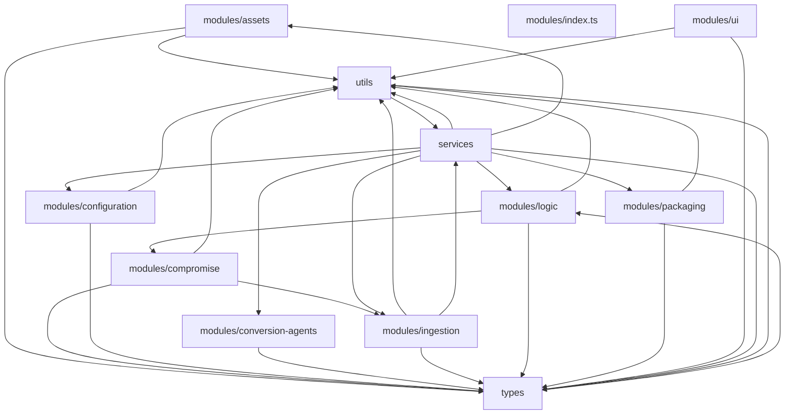

# Module Dependency Graph

This document shows the dependencies between modules in the Minecraft Mod Converter.

## Dependency Graph

## Module Descriptions

- **modules/assets**: Handles conversion of textures, models, sounds, and particles
- **modules/compromise**: Implements smart compromise strategies for unsupported features
- **modules/configuration**: Converts manifests, recipes, and configuration files
- **modules/conversion-agents**: Module description not available
- **modules/index.ts**: Module description not available
- **modules/ingestion**: Validates and analyzes input Java mods
- **modules/logic**: Transpiles Java code to JavaScript
- **modules/packaging**: Packages and validates the final addon
- **modules/ui**: Provides the React-based user interface
- **services**: Core application services and infrastructure
- **types**: TypeScript type definitions
- **utils**: Utility functions and helpers

## Dependency Analysis

- **Total Modules**: 12
- **Total Dependencies**: 29
- **Circular Dependencies**: 9

## ⚠️ Circular Dependencies Detected

### Circular Dependency 1
`utils → services → modules/logic → utils`

### Circular Dependency 2
`modules/logic → modules/compromise → types → modules/logic`

### Circular Dependency 3
`utils → services → modules/logic → modules/compromise → modules/ingestion → utils`

### Circular Dependency 4
`services → modules/logic → modules/compromise → modules/ingestion → services`

### Circular Dependency 5
`utils → services → modules/logic → modules/compromise → utils`

### Circular Dependency 6
`utils → services → utils`

### Circular Dependency 7
`modules/assets → utils → services → modules/assets`

### Circular Dependency 8
`utils → services → modules/configuration → utils`

### Circular Dependency 9
`utils → services → modules/packaging → utils`

