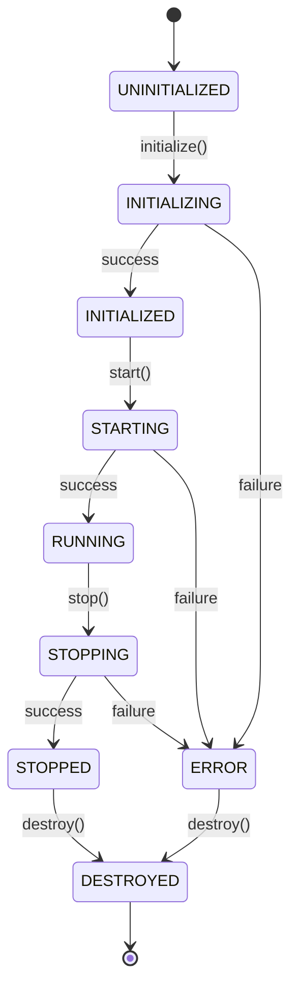

# Module Initialization System

This document describes the standardized module initialization system implemented in the Minecraft Mod Converter.

## Overview

The module initialization system provides:
- **Consistent Initialization Pattern**: All modules follow the same lifecycle
- **Dependency Injection**: Modules receive their dependencies through a container
- **Lifecycle Management**: Proper startup, shutdown, and cleanup procedures
- **Health Monitoring**: Built-in health checks and metrics
- **Error Handling**: Graceful error handling and recovery

## Architecture

### Core Components

1. **Module Interface**: Defines the contract all modules must implement
2. **BaseModule**: Abstract base class providing common functionality
3. **DependencyContainer**: Manages dependency injection
4. **ModuleRegistry**: Manages module registration and lifecycle
5. **ModuleBootstrap**: Orchestrates the entire system startup

### Module Lifecycle



## Creating a Standardized Module

### 1. Implement the Module Interface

```typescript
import { BaseModule, ModuleConfig, DependencyContainer } from '../types/modules';

export class MyModule extends BaseModule {
  constructor(config: ModuleConfig, dependencies: DependencyContainer) {
    super(config, dependencies);
  }

  protected async onInitialize(): Promise<void> {
    // Initialize your module here
    // Get dependencies: this.getDependency<Type>('dependencyId')
    // Get config: this.getConfig<Type>('configKey', defaultValue)
  }

  protected async onStart(): Promise<void> {
    // Start your module here
  }

  protected async onStop(): Promise<void> {
    // Stop your module gracefully
  }

  protected async onDestroy(): Promise<void> {
    // Clean up resources
  }

  protected getMetrics(): Record<string, any> {
    // Return module-specific metrics
    return {};
  }
}
```

### 2. Register the Module

```typescript
import { createBootstrap } from '../services/ModuleBootstrap';

const bootstrap = createBootstrap();

// Register your module
bootstrap.getModuleRegistry().register(MyModule, {
  id: 'myModule',
  name: 'My Module',
  dependencies: ['configurationService', 'logger'],
  config: {
    // Module-specific configuration
    myModuleConfig: {
      setting1: 'value1',
      setting2: 42
    }
  },
  autoStart: true
});
```

## Dependency Injection

### Registering Dependencies

```typescript
const container = bootstrap.getDependencyContainer();

// Register an instance
container.register('myService', new MyService());

// Register a singleton factory
container.registerSingleton('myService', () => new MyService());

// Register a transient factory (new instance each time)
container.registerTransient('myService', () => new MyService());
```

### Using Dependencies in Modules

```typescript
export class MyModule extends BaseModule {
  private myService: MyService;

  protected async onInitialize(): Promise<void> {
    // Get dependency from container
    this.myService = this.getDependency<MyService>('myService');
  }
}
```

## Configuration Management

### Module Configuration

```typescript
export class MyModule extends BaseModule {
  protected async onInitialize(): Promise<void> {
    // Get configuration with default values
    const config = this.getConfig('myModule', {
      defaultSetting: 'defaultValue',
      timeout: 5000
    });

    // Use configuration
    console.log(`Setting: ${config.defaultSetting}`);
  }
}
```

### Bootstrap Configuration

```typescript
const bootstrap = createBootstrap({
  environment: 'development',
  debug: true,
  configPath: './config/app.json'
});
```

## Lifecycle Management

### System Startup

```typescript
const bootstrap = createBootstrap();

try {
  // Initialize all modules
  await bootstrap.initialize();
  
  // Start all modules
  await bootstrap.start();
  
  console.log('System started successfully');
} catch (error) {
  console.error('Failed to start system:', error);
  await bootstrap.shutdown();
}
```

### Graceful Shutdown

```typescript
// Set up graceful shutdown
const gracefulShutdown = async (signal: string) => {
  console.log(`Received ${signal}, shutting down...`);
  
  try {
    await bootstrap.shutdown();
    process.exit(0);
  } catch (error) {
    console.error('Error during shutdown:', error);
    process.exit(1);
  }
};

process.on('SIGTERM', () => gracefulShutdown('SIGTERM'));
process.on('SIGINT', () => gracefulShutdown('SIGINT'));
```

## Health Monitoring

### System Health

```typescript
const healthStatus = bootstrap.getHealthStatus();
console.log('System Health:', healthStatus);
```

### Module Health

```typescript
const moduleRegistry = bootstrap.getModuleRegistry();
const module = moduleRegistry.get('myModule');

if (module) {
  const health = module.getHealth();
  console.log(`Module Health:`, health);
}
```

## Error Handling

### Module Error Handling

```typescript
export class MyModule extends BaseModule {
  protected async onInitialize(): Promise<void> {
    try {
      // Initialization logic
    } catch (error) {
      this.logger.error('Initialization failed:', error);
      throw error; // Re-throw to fail initialization
    }
  }
}
```

### System Error Handling

```typescript
try {
  await bootstrap.initialize();
  await bootstrap.start();
} catch (error) {
  console.error('System startup failed:', error);
  
  // Attempt graceful cleanup
  try {
    await bootstrap.shutdown();
  } catch (shutdownError) {
    console.error('Shutdown failed:', shutdownError);
  }
}
```

## Best Practices

### 1. Keep Modules Focused

Each module should have a single, well-defined responsibility.

### 2. Use Dependency Injection

Don't create dependencies directly; inject them through the container.

```typescript
// ❌ Bad: Direct dependency creation
export class MyModule extends BaseModule {
  private service = new MyService(); // Hard to test and configure
}

// ✅ Good: Dependency injection
export class MyModule extends BaseModule {
  private service: MyService;
  
  protected async onInitialize(): Promise<void> {
    this.service = this.getDependency<MyService>('myService');
  }
}
```

### 3. Handle Errors Gracefully

Always handle errors appropriately and provide meaningful error messages.

### 4. Implement Health Checks

Provide meaningful health information and metrics.

```typescript
protected getMetrics(): Record<string, any> {
  return {
    requestsProcessed: this.requestCount,
    averageResponseTime: this.totalTime / this.requestCount,
    errorRate: this.errorCount / this.requestCount,
    lastError: this.lastError?.message
  };
}
```

### 5. Clean Up Resources

Always clean up resources in the `onDestroy` method.

```typescript
protected async onDestroy(): Promise<void> {
  // Close connections
  if (this.connection) {
    await this.connection.close();
  }
  
  // Clear timers
  if (this.timer) {
    clearInterval(this.timer);
  }
  
  // Clear caches
  this.cache.clear();
}
```

## Migration Guide

### Converting Existing Modules

1. **Extend BaseModule** instead of creating standalone classes
2. **Move initialization logic** to `onInitialize()`
3. **Extract dependencies** to be injected rather than created directly
4. **Add configuration support** using `getConfig()`
5. **Implement lifecycle methods** (`onStart`, `onStop`, `onDestroy`)
6. **Add health checks** in `getMetrics()`

### Example Migration

```typescript
// Before: Old module pattern
export class OldModule {
  private service: MyService;
  
  constructor() {
    this.service = new MyService(); // Direct dependency
  }
  
  public doSomething() {
    // Business logic
  }
}

// After: Standardized module pattern
export class NewModule extends BaseModule {
  private service: MyService;
  
  constructor(config: ModuleConfig, dependencies: DependencyContainer) {
    super(config, dependencies);
  }
  
  protected async onInitialize(): Promise<void> {
    this.service = this.getDependency<MyService>('myService');
  }
  
  protected async onStart(): Promise<void> {
    // Startup logic
  }
  
  protected async onStop(): Promise<void> {
    // Shutdown logic
  }
  
  protected async onDestroy(): Promise<void> {
    // Cleanup logic
  }
  
  protected getMetrics(): Record<string, any> {
    return { /* metrics */ };
  }
  
  public doSomething() {
    // Business logic (unchanged)
  }
}
```

## Testing

### Unit Testing Modules

```typescript
import { ModuleConfig, DependencyContainer } from '../types/modules';
import { MyModule } from './MyModule';

describe('MyModule', () => {
  let module: MyModule;
  let mockContainer: DependencyContainer;
  
  beforeEach(() => {
    mockContainer = {
      get: jest.fn(),
      has: jest.fn(),
      register: jest.fn(),
      registerFactory: jest.fn()
    };
    
    const config: ModuleConfig = {
      id: 'test',
      name: 'Test Module',
      dependencies: ['myService']
    };
    
    module = new MyModule(config, mockContainer);
  });
  
  it('should initialize successfully', async () => {
    mockContainer.get = jest.fn().mockReturnValue(new MockService());
    
    await module.initialize(mockContainer);
    
    expect(module.state).toBe('initialized');
  });
});
```

## Troubleshooting

### Common Issues

1. **Circular Dependencies**: Use the dependency validation script to detect and fix
2. **Missing Dependencies**: Ensure all required dependencies are registered
3. **Initialization Order**: Dependencies are initialized before dependents
4. **Configuration Issues**: Use proper configuration structure and defaults

### Debugging

```typescript
// Enable debug logging
const bootstrap = createBootstrap({ debug: true });

// Check dependency registration
const container = bootstrap.getDependencyContainer();
console.log('Registered dependencies:', container.getRegisteredIdentifiers());

// Check module health
const healthStatus = bootstrap.getHealthStatus();
console.log('System health:', healthStatus);
```