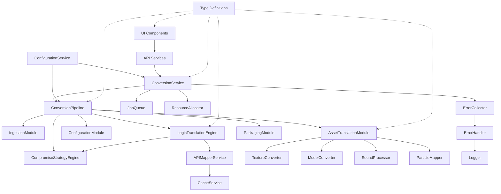
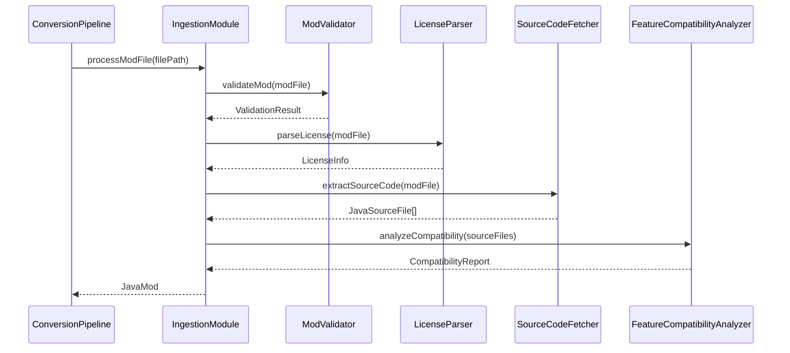
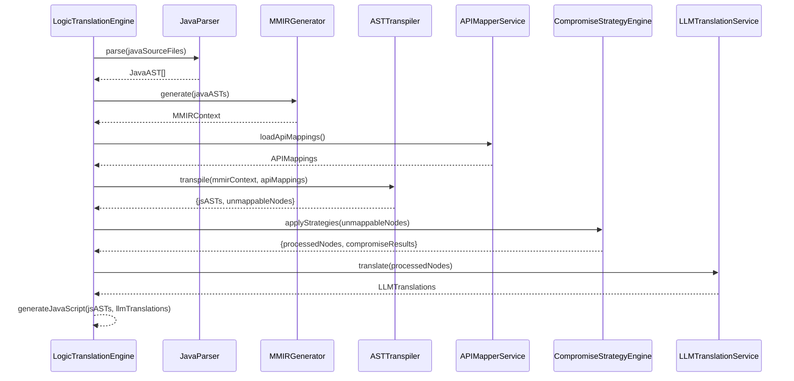
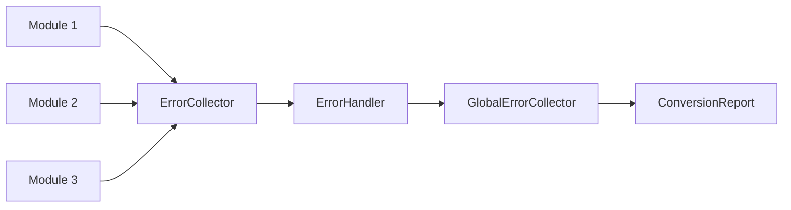
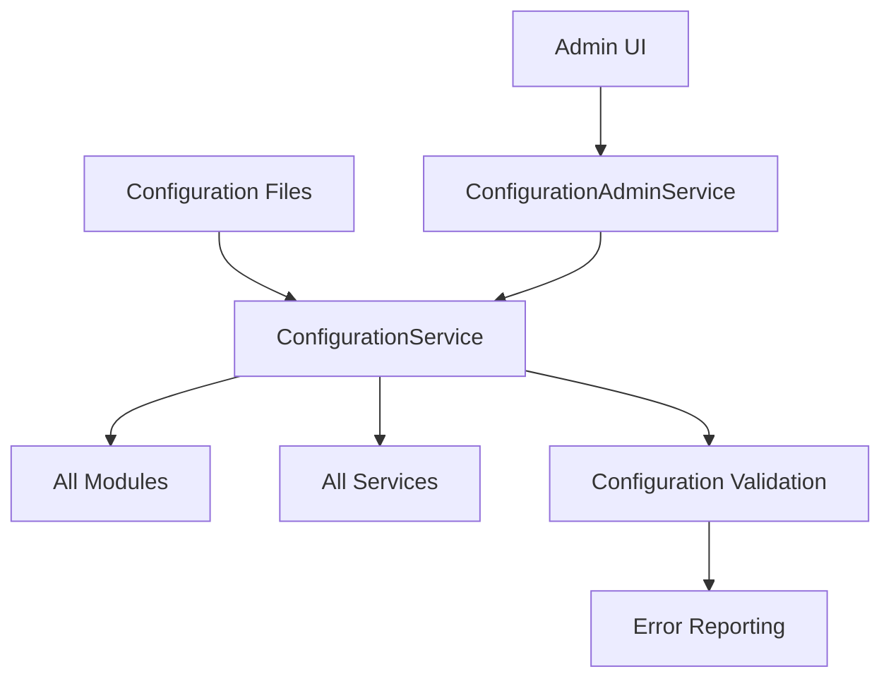
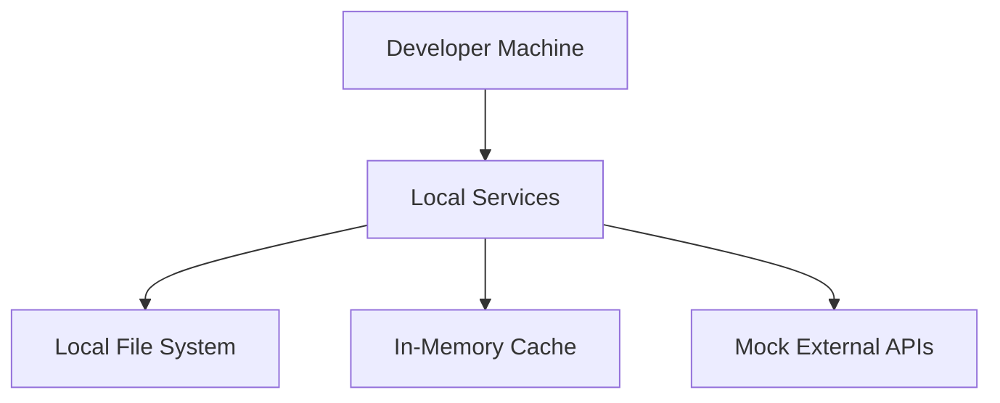
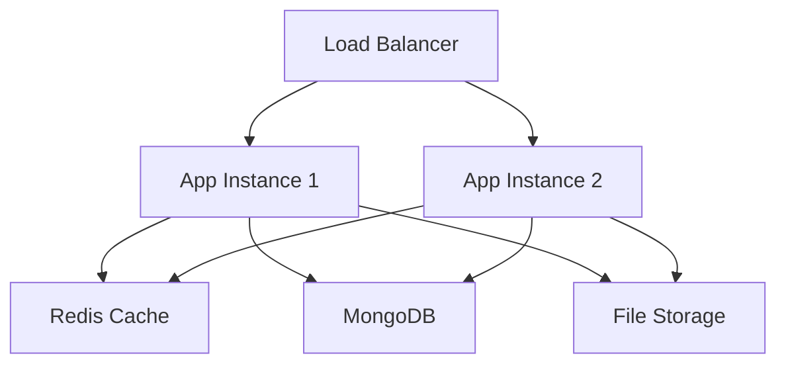

# Module Interactions and Dependencies

This document provides a comprehensive overview of how modules interact within the Minecraft Mod Converter system, including dependency relationships, data flow, and integration points.

## System Architecture Overview

The Minecraft Mod Converter follows a modular architecture with clear separation of concerns. The system is organized into several layers:

1. **Service Layer** - Core services for orchestration and infrastructure
2. **Module Layer** - Specialized conversion modules
3. **UI Layer** - User interface components and services
4. **Type Layer** - Shared type definitions and interfaces

## Module Dependency Graph



## Core Service Interactions

### ConversionService ↔ ConversionPipeline

**Relationship**: ConversionService orchestrates the ConversionPipeline
**Data Flow**: 
- ConversionService receives conversion requests
- Creates jobs in JobQueue
- ConversionPipeline processes jobs through module stages
- Status updates flow back to ConversionService

**Key Interfaces**:
```typescript
interface ConversionPipelineInput {
  inputPath: string;
  outputPath: string;
  modId: string;
  modName: string;
  modVersion: string;
  generateReport: boolean;
  packageAddon: boolean;
}

interface ConversionPipelineResult {
  success: boolean;
  bedrockAddon?: BedrockAddon;
  report?: ConversionReport;
  errors: ConversionError[];
}
```

### JobQueue ↔ ResourceAllocator

**Relationship**: ResourceAllocator manages resources for jobs in JobQueue
**Data Flow**:
- JobQueue requests resource allocation for jobs
- ResourceAllocator tracks and limits concurrent job execution
- Resource deallocation occurs on job completion

**Resource Types**:
- CPU cores for parallel processing
- Memory for large mod files
- Disk space for temporary files
- Network connections for external API calls

## Module Processing Pipeline

### 1. Ingestion Stage

**Primary Module**: IngestionModule
**Dependencies**: 
- ModValidator
- LicenseParser
- SourceCodeFetcher
- FeatureCompatibilityAnalyzer

**Input**: Raw mod file (JAR/ZIP)
**Output**: Structured JavaMod object

**Process Flow**:


### 2. Asset Translation Stage

**Primary Module**: AssetTranslationModule
**Dependencies**:
- TextureConverter
- ModelConverter
- SoundProcessor
- ParticleMapper

**Input**: JavaAssetCollection
**Output**: BedrockAssetCollection

**Parallel Processing**:
Assets are processed in parallel for performance:
- Textures: PNG format conversion, atlas generation
- Models: JSON format transformation
- Sounds: OGG conversion, sounds.json generation
- Particles: Bedrock particle system mapping

### 3. Configuration Translation Stage

**Primary Module**: ConfigurationModule
**Dependencies**:
- BlockItemDefinitionConverter
- RecipeConverter
- LootTableConverter
- ManifestGenerator

**Input**: JavaConfigurationFiles
**Output**: BedrockConfigurationFiles

### 4. Logic Translation Stage

**Primary Module**: LogicTranslationEngine
**Dependencies**:
- JavaParser
- MMIRGenerator
- ASTTranspiler
- APIMapperService
- LLMTranslationService
- CompromiseStrategyEngine

**Complex Interaction Flow**:


### 5. Compromise Strategy Integration

**Primary Module**: CompromiseStrategyEngine
**Integration Points**:
- LogicTranslationEngine (unmappable code handling)
- UI Services (user preference application)
- Reporting (compromise documentation)

**Strategy Types**:
- Stubbing: Generate placeholder implementations
- Simulation: Create behavioral approximations
- Warning: Document limitations and alternatives
- Removal: Remove incompatible features with user consent

### 6. Packaging Stage

**Primary Module**: PackagingModule
**Dependencies**:
- AddonPackager
- AddonValidator
- ConversionReportGenerator

**Input**: All converted components
**Output**: Complete Bedrock addon package

## Error Handling and Reporting

### Error Collection Flow



**Error Categories**:
- Validation errors (input validation failures)
- Asset errors (conversion issues)
- Logic errors (code translation problems)
- System errors (infrastructure failures)
- Compromise errors (feature limitation notifications)

### Error Propagation

1. **Module Level**: Modules collect local errors
2. **Pipeline Level**: ConversionPipeline aggregates module errors
3. **Service Level**: ConversionService provides error summaries
4. **UI Level**: Error display and user notifications

## Configuration Management

### Configuration Flow



**Configuration Scopes**:
- System-wide settings (logging, performance)
- Module-specific settings (conversion parameters)
- User preferences (compromise strategies)
- Environment-specific settings (development/production)

## API Integration Points

### External APIs

1. **Minecraft API Documentation**
   - Used by: APIMapperService
   - Purpose: API mapping updates
   - Caching: Aggressive caching with TTL

2. **GitHub API**
   - Used by: SourceCodeFetcher, UpdateService
   - Purpose: Source code retrieval, mapping updates
   - Rate limiting: Implemented with backoff

3. **LLM Services**
   - Used by: LLMTranslationService
   - Purpose: Complex code translation
   - Fallback: Local processing for failures

### Internal APIs

1. **Conversion API**
   - Consumers: UI components
   - Provider: ConversionService
   - Protocol: REST/WebSocket for real-time updates

2. **Admin API**
   - Consumers: Admin UI
   - Provider: Various admin services
   - Security: Role-based access control

## Performance Considerations

### Parallel Processing

1. **Asset Processing**: Independent asset types processed in parallel
2. **Job Queue**: Multiple jobs processed concurrently
3. **Resource Management**: CPU and memory allocation optimization

### Caching Strategy

1. **API Mappings**: Long-term cache with version invalidation
2. **Mod Analysis**: Cache based on mod file hash
3. **Asset Conversion**: Cache converted assets for reuse
4. **Code Translation**: Cache LLM translations

### Memory Management

1. **Streaming Processing**: Large files processed in chunks
2. **Resource Cleanup**: Automatic cleanup of temporary files
3. **Memory Monitoring**: Resource usage tracking and alerts

## Testing Integration Points

### Unit Testing

- Individual module testing with mocked dependencies
- Service testing with dependency injection
- Type validation testing

### Integration Testing

- Module interaction testing
- Pipeline end-to-end testing
- Error handling validation
- Performance benchmarking

### Security Testing

- Input validation testing
- Authentication/authorization testing
- Data sanitization validation

## Deployment Architecture

### Development Environment



### Production Environment



## Future Architecture Considerations

### Scalability

1. **Microservices**: Potential split into independent services
2. **Message Queues**: Asynchronous processing with message brokers
3. **Container Orchestration**: Kubernetes deployment
4. **Auto-scaling**: Dynamic resource allocation

### Extensibility

1. **Plugin Architecture**: Third-party module integration
2. **API Versioning**: Backward compatibility maintenance
3. **Configuration Management**: Dynamic configuration updates
4. **Monitoring**: Comprehensive observability

This architectural documentation provides the foundation for understanding how the system components interact and can be extended or modified while maintaining system integrity.