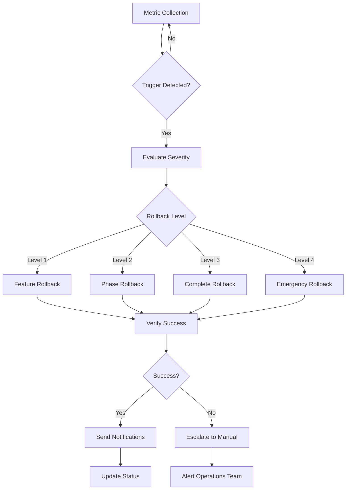

# CI/CD Pipeline Rollback Plan

## Overview

This document outlines the comprehensive rollback plan for the enhanced GitHub Actions CI/CD pipeline migration. It provides procedures for both automatic and manual rollbacks, ensuring system stability and minimal disruption during the migration process.

## Table of Contents

1. [Rollback Strategy](#rollback-strategy)
2. [Rollback Triggers](#rollback-triggers)
3. [Automatic Rollback Procedures](#automatic-rollback-procedures)
4. [Manual Rollback Procedures](#manual-rollback-procedures)
5. [Emergency Rollback](#emergency-rollback)
6. [Post-Rollback Procedures](#post-rollback-procedures)
7. [Recovery Planning](#recovery-planning)

## Rollback Strategy

### Rollback Principles

1. **Safety First**: Always prioritize system stability over feature advancement
2. **Minimal Disruption**: Rollbacks should cause minimal impact to ongoing development
3. **Data Integrity**: Ensure no data loss during rollback operations
4. **Quick Recovery**: Enable rapid restoration of previous working state
5. **Clear Communication**: Keep all stakeholders informed during rollback events

### Rollback Levels

#### Level 1: Feature Flag Rollback
- **Scope**: Disable specific features while maintaining overall pipeline
- **Impact**: Minimal - affects only specific functionality
- **Duration**: < 5 minutes
- **Trigger**: Feature-specific issues

#### Level 2: Phase Rollback
- **Scope**: Rollback entire migration phase
- **Impact**: Moderate - reverts multiple features
- **Duration**: 5-15 minutes
- **Trigger**: Phase validation failures

#### Level 3: Complete Rollback
- **Scope**: Return to original basic CI workflow
- **Impact**: High - reverts all enhancements
- **Duration**: 15-30 minutes
- **Trigger**: Critical system failures

#### Level 4: Emergency Rollback
- **Scope**: Immediate system restoration
- **Impact**: Critical - may cause temporary service disruption
- **Duration**: < 2 minutes
- **Trigger**: Production outages

## Rollback Triggers

### Automatic Rollback Triggers

#### Performance Triggers
- Build failure rate > 10% over 1 hour
- Average build time > 10 minutes for 3 consecutive builds
- Test failure rate > 5% over 30 minutes
- Deployment failure rate > 5% over 1 hour

#### Security Triggers
- Critical security vulnerability detected
- Secret exposure in code
- Security scan failure rate > 20%
- Unauthorized access attempts

#### System Health Triggers
- Service availability < 99% over 15 minutes
- Error rate > 5% over 10 minutes
- Response time > 2x baseline for 15 minutes
- Memory usage > 90% for 10 minutes

#### User Impact Triggers
- User-reported critical issues > 3 in 1 hour
- Support ticket volume increase > 200%
- Negative user feedback > 70% in 24 hours

### Manual Rollback Triggers

#### Business Triggers
- Stakeholder decision to halt migration
- Regulatory compliance issues
- Budget constraints
- Timeline pressures

#### Technical Triggers
- Unforeseen technical complications
- Integration failures with external systems
- Performance degradation not caught by automatic triggers
- Team capacity issues

## Automatic Rollback Procedures

### Trigger Detection System

The migration orchestrator continuously monitors system metrics and automatically initiates rollbacks when trigger conditions are met.

```javascript
// Example trigger configuration
const rollbackTriggers = {
  buildFailureRate: {
    threshold: 10, // percentage
    timeWindow: 60, // minutes
    action: 'rollback_phase'
  },
  criticalSecurity: {
    threshold: 1, // count
    timeWindow: 1, // minutes
    action: 'emergency_rollback'
  },
  deploymentFailure: {
    threshold: 5, // percentage
    timeWindow: 60, // minutes
    action: 'rollback_feature'
  }
};
```

### Automatic Rollback Execution

1. **Trigger Detection**
   ```bash
   # Monitor metrics
   ./scripts/migration-orchestrator.js monitor
   
   # Automatic trigger evaluation every 5 minutes
   # Immediate action on critical triggers
   ```

2. **Rollback Decision**
   ```bash
   # Evaluate rollback level based on trigger severity
   # Level 1-2: Feature/Phase rollback
   # Level 3-4: Complete/Emergency rollback
   ```

3. **Rollback Execution**
   ```bash
   # Execute appropriate rollback level
   ./scripts/migration-orchestrator.js rollback
   
   # Verify rollback success
   ./scripts/validate-rollback-success.sh
   ```

4. **Notification**
   ```bash
   # Send automatic notifications
   # Slack alerts for team
   # Email notifications for stakeholders
   # Status page updates
   ```

### Automatic Rollback Workflow



## Manual Rollback Procedures

### Manual Rollback Initiation

#### Prerequisites
- Operations team member with appropriate access
- Rollback reason documented
- Stakeholder approval (for non-emergency situations)
- Communication plan activated

#### Step-by-Step Manual Rollback

1. **Assessment Phase (2-5 minutes)**
   ```bash
   # Check current system status
   ./scripts/migration-orchestrator.js status
   
   # Review recent metrics
   ./scripts/check-pipeline-health.sh
   
   # Identify rollback scope
   ./scripts/assess-rollback-scope.sh
   ```

2. **Preparation Phase (3-5 minutes)**
   ```bash
   # Backup current state
   ./scripts/backup-current-state.sh
   
   # Prepare rollback environment
   ./scripts/prepare-rollback-environment.sh
   
   # Notify team of impending rollback
   ./scripts/send-rollback-notification.sh "Manual rollback initiated"
   ```

3. **Execution Phase (5-15 minutes)**
   ```bash
   # Execute rollback based on level
   
   # Level 1: Feature rollback
   ./scripts/feature-flag-manager.js disable <feature-name>
   
   # Level 2: Phase rollback
   ./scripts/migration-orchestrator.js rollback
   
   # Level 3: Complete rollback
   ./scripts/complete-rollback.sh
   
   # Level 4: Emergency rollback
   ./scripts/emergency-rollback.sh
   ```

4. **Verification Phase (3-5 minutes)**
   ```bash
   # Verify rollback success
   ./scripts/verify-rollback-success.sh
   
   # Check system health
   curl -f https://api.modporter.ai/health
   
   # Validate core functionality
   ./scripts/validate-core-functionality.sh
   ```

5. **Communication Phase (2-3 minutes)**
   ```bash
   # Update status page
   ./scripts/update-status-page.sh "System restored to previous version"
   
   # Notify stakeholders
   ./scripts/notify-stakeholders.sh --type=rollback-complete
   
   # Document rollback details
   ./scripts/document-rollback.sh
   ```

### Manual Rollback Commands

#### Feature-Level Rollback
```bash
# Disable specific feature
./scripts/feature-flag-manager.js disable enhancedCI

# Verify feature disabled
./scripts/feature-flag-manager.js status

# Test system functionality
npm test
```

#### Phase-Level Rollback
```bash
# Rollback current phase
./scripts/migration-orchestrator.js rollback

# Check rollback status
./scripts/migration-orchestrator.js status

# Validate previous phase functionality
./scripts/validate-phase-functionality.sh
```

#### Complete Rollback
```bash
# Backup enhanced workflows
cp -r .github/workflows .github/workflows-enhanced-backup

# Restore original workflows
cp -r .github/workflows-backup/* .github/workflows/

# Remove enhanced workflows
rm .github/workflows/ci-enhanced.yml
rm .github/workflows/security.yml
rm .github/workflows/deploy.yml

# Verify original workflow
gh workflow list
```

## Emergency Rollback

### Emergency Rollback Triggers

- Production system completely down
- Data corruption detected
- Security breach in progress
- Critical business impact

### Emergency Rollback Procedure

#### Immediate Actions (0-2 minutes)

1. **Declare Emergency**
   ```bash
   # Activate emergency procedures
   ./scripts/declare-emergency.sh
   
   # Send critical alerts
   ./scripts/send-critical-alert.sh "EMERGENCY ROLLBACK IN PROGRESS"
   ```

2. **Execute Emergency Rollback**
   ```bash
   # Immediate rollback to last known good state
   ./scripts/emergency-rollback.sh
   
   # This script:
   # - Disables all enhanced workflows
   # - Restores original CI workflow
   # - Cancels all running jobs
   # - Reverts to previous deployment
   ```

3. **Verify System Recovery**
   ```bash
   # Check critical systems
   curl -f https://api.modporter.ai/health
   
   # Verify core functionality
   ./scripts/emergency-health-check.sh
   ```

#### Follow-up Actions (2-15 minutes)

1. **Stabilize System**
   ```bash
   # Ensure all services are running
   ./scripts/verify-all-services.sh
   
   # Check data integrity
   ./scripts/check-data-integrity.sh
   
   # Monitor error rates
   ./scripts/monitor-error-rates.sh
   ```

2. **Communicate Status**
   ```bash
   # Update status page
   ./scripts/update-status-page.sh "Emergency rollback completed, investigating"
   
   # Notify all stakeholders
   ./scripts/emergency-notification.sh
   ```

3. **Begin Investigation**
   ```bash
   # Collect incident data
   ./scripts/collect-incident-data.sh
   
   # Preserve logs and metrics
   ./scripts/preserve-incident-logs.sh
   ```

### Emergency Rollback Script

```bash
#!/bin/bash
# emergency-rollback.sh

set -e

echo "🚨 EMERGENCY ROLLBACK INITIATED"
echo "Timestamp: $(date)"

# Cancel all running workflows
echo "Cancelling running workflows..."
gh run list --status in_progress --json databaseId --jq '.[].databaseId' | xargs -I {} gh run cancel {}

# Disable enhanced workflows
echo "Disabling enhanced workflows..."
mv .github/workflows/ci-enhanced.yml .github/workflows/ci-enhanced.yml.disabled || true
mv .github/workflows/security.yml .github/workflows/security.yml.disabled || true
mv .github/workflows/deploy.yml .github/workflows/deploy.yml.disabled || true

# Restore original CI workflow
echo "Restoring original CI workflow..."
if [ -f .github/workflows-backup/ci.yml ]; then
    cp .github/workflows-backup/ci.yml .github/workflows/ci.yml
fi

# Trigger immediate deployment of previous version
echo "Deploying previous version..."
./scripts/deploy-previous-version.sh

# Verify system health
echo "Verifying system health..."
sleep 30
curl -f https://api.modporter.ai/health || {
    echo "❌ Health check failed after rollback"
    exit 1
}

echo "✅ Emergency rollback completed"
echo "Next steps:"
echo "1. Verify all systems are operational"
echo "2. Investigate root cause"
echo "3. Communicate with stakeholders"
echo "4. Plan recovery strategy"
```

## Post-Rollback Procedures
id: post-rollback-procedures

### Immediate Post-Rollback (0-30 minutes)

1. **System Verification**
   ```bash
   # Comprehensive health check
   ./scripts/comprehensive-health-check.sh
   
   # Performance validation
   ./scripts/validate-performance.sh
   
   # Security verification
   ./scripts/verify-security-posture.sh
   ```

2. **Stakeholder Communication**
   ```bash
   # Send rollback completion notification
   ./scripts/send-rollback-completion.sh
   
   # Update documentation
   ./scripts/update-rollback-documentation.sh
   
   # Schedule post-mortem meeting
   ./scripts/schedule-post-mortem.sh
   ```

3. **Monitoring Enhancement**
   ```bash
   # Increase monitoring frequency
   ./scripts/enhance-monitoring.sh
   
   # Set up additional alerts
   ./scripts/setup-additional-alerts.sh
   ```

### Short-term Post-Rollback (1-24 hours)

1. **Root Cause Analysis**
   ```bash
   # Collect all relevant data
   ./scripts/collect-rollback-data.sh
   
   # Analyze failure patterns
   ./scripts/analyze-failure-patterns.sh
   
   # Generate RCA report
   ./scripts/generate-rca-report.sh
   ```

2. **System Stabilization**
   ```bash
   # Monitor system stability
   ./scripts/monitor-system-stability.sh --duration=24h
   
   # Validate all integrations
   ./scripts/validate-all-integrations.sh
   
   # Performance baseline re-establishment
   ./scripts/establish-performance-baseline.sh
   ```

3. **Team Debrief**
   ```bash
   # Conduct team retrospective
   # Document lessons learned
   # Update procedures based on findings
   # Plan improvement actions
   ```

### Long-term Post-Rollback (1-7 days)

1. **Process Improvement**
   ```bash
   # Update rollback procedures
   ./scripts/update-rollback-procedures.sh
   
   # Enhance monitoring and alerting
   ./scripts/enhance-monitoring-alerting.sh
   
   # Improve testing procedures
   ./scripts/improve-testing-procedures.sh
   ```

2. **Recovery Planning**
   ```bash
   # Develop recovery strategy
   ./scripts/develop-recovery-strategy.sh
   
   # Plan next migration attempt
   ./scripts/plan-next-migration.sh
   
   # Update risk assessment
   ./scripts/update-risk-assessment.sh
   ```

## Recovery Planning

### Recovery Strategy Development

#### Assessment Phase
1. **Analyze Rollback Cause**
   - Technical root cause analysis
   - Process failure analysis
   - Communication breakdown analysis
   - Timeline analysis

2. **Impact Assessment**
   - Business impact evaluation
   - Technical debt assessment
   - Team morale impact
   - Stakeholder confidence impact

3. **Risk Re-evaluation**
   - Update risk register
   - Identify new risks
   - Reassess risk mitigation strategies
   - Update rollback triggers

#### Planning Phase
1. **Recovery Timeline**
   - Immediate fixes (0-7 days)
   - Short-term improvements (1-4 weeks)
   - Long-term strategy (1-3 months)

2. **Resource Allocation**
   - Team capacity planning
   - Budget considerations
   - External support needs
   - Training requirements

3. **Success Criteria**
   - Updated success metrics
   - Enhanced monitoring
   - Improved testing
   - Better communication

#### Execution Phase
1. **Gradual Re-introduction**
   - Start with lowest risk features
   - Increase monitoring frequency
   - Smaller rollout phases
   - More frequent checkpoints

2. **Enhanced Validation**
   - Additional testing phases
   - Extended monitoring periods
   - More conservative success criteria
   - Faster rollback triggers

### Recovery Best Practices

1. **Learn from Failure**
   - Document all lessons learned
   - Share knowledge across teams
   - Update training materials
   - Improve procedures

2. **Build Confidence**
   - Start with small, safe changes
   - Demonstrate quick wins
   - Maintain transparent communication
   - Celebrate incremental progress

3. **Strengthen Foundation**
   - Improve testing coverage
   - Enhance monitoring capabilities
   - Strengthen rollback procedures
   - Build better safety nets

## Rollback Testing

### Regular Rollback Drills

#### Monthly Rollback Tests
```bash
# Simulate rollback scenarios
./scripts/simulate-rollback-scenario.sh --scenario=feature-failure

# Test rollback procedures
./scripts/test-rollback-procedures.sh --level=1

# Validate rollback timing
./scripts/measure-rollback-time.sh
```

#### Quarterly Emergency Drills
```bash
# Full emergency rollback simulation
./scripts/emergency-rollback-drill.sh

# Team response time measurement
./scripts/measure-response-time.sh

# Communication effectiveness test
./scripts/test-communication-procedures.sh
```

### Rollback Validation Checklist

- [ ] Rollback procedures documented and accessible
- [ ] All team members trained on rollback procedures
- [ ] Rollback scripts tested and validated
- [ ] Monitoring and alerting systems functional
- [ ] Communication channels established
- [ ] Backup and recovery systems verified
- [ ] Emergency contact information updated
- [ ] Rollback success criteria defined
- [ ] Post-rollback procedures documented
- [ ] Recovery planning completed

---

## Contact Information

### Emergency Contacts

| Role | Primary | Secondary | Phone |
|------|---------|-----------|-------|
| DevOps Lead | John Doe | Jane Smith | +1-555-0101 |
| Engineering Manager | Alice Johnson | Bob Wilson | +1-555-0102 |
| Security Lead | Carol Brown | David Lee | +1-555-0103 |
| Product Manager | Eve Davis | Frank Miller | +1-555-0104 |

### Communication Channels

- **Emergency Slack**: #emergency-response
- **DevOps Slack**: #devops-alerts
- **Email**: emergency@company.com
- **Status Page**: https://status.company.com
- **Incident Management**: https://company.pagerduty.com

---

*This rollback plan is maintained by the DevOps team and reviewed quarterly. Last updated: $(date)*
