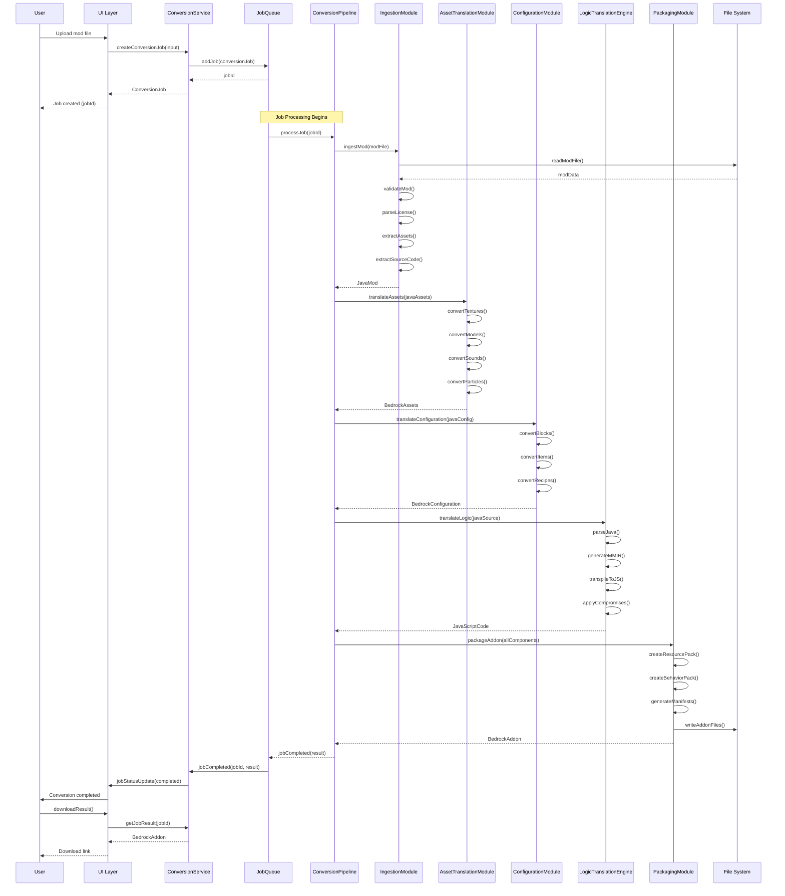
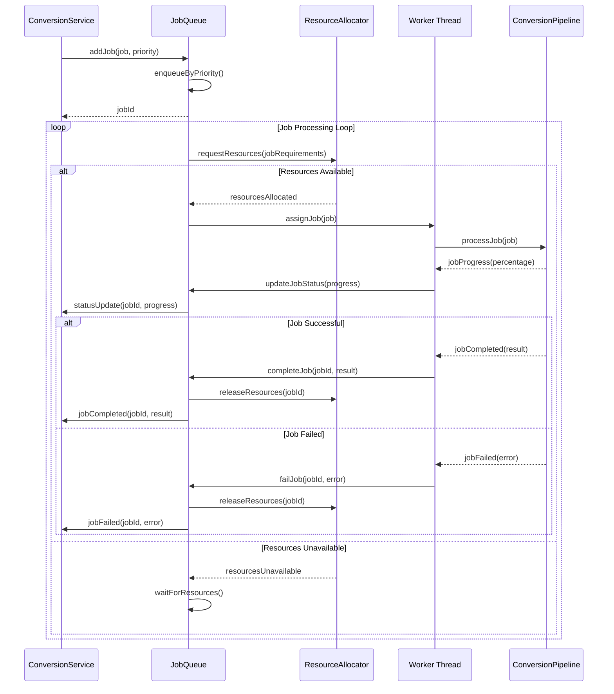
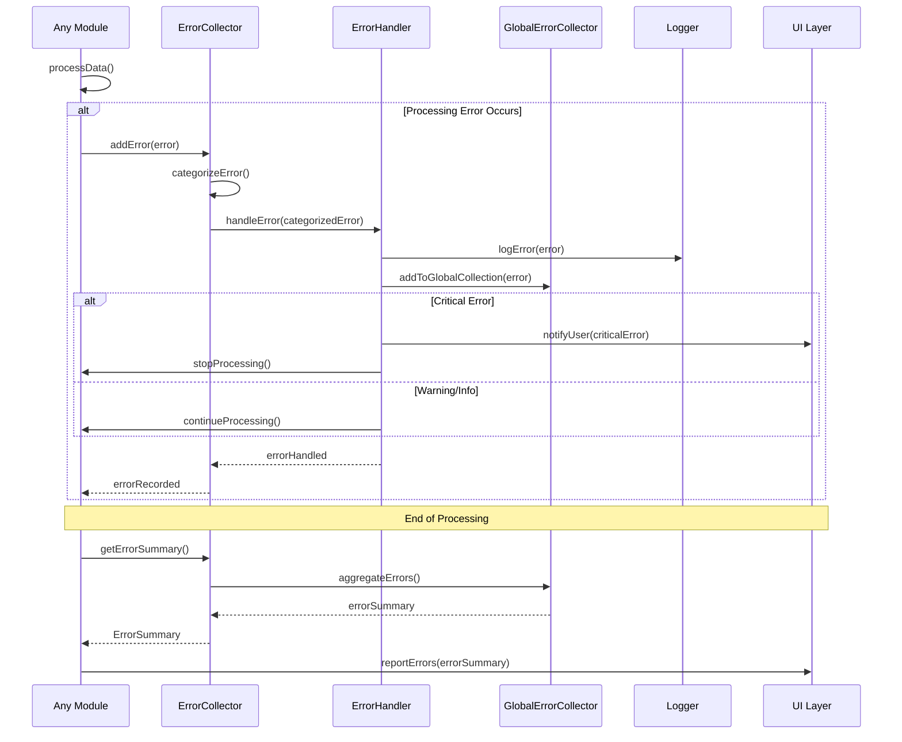
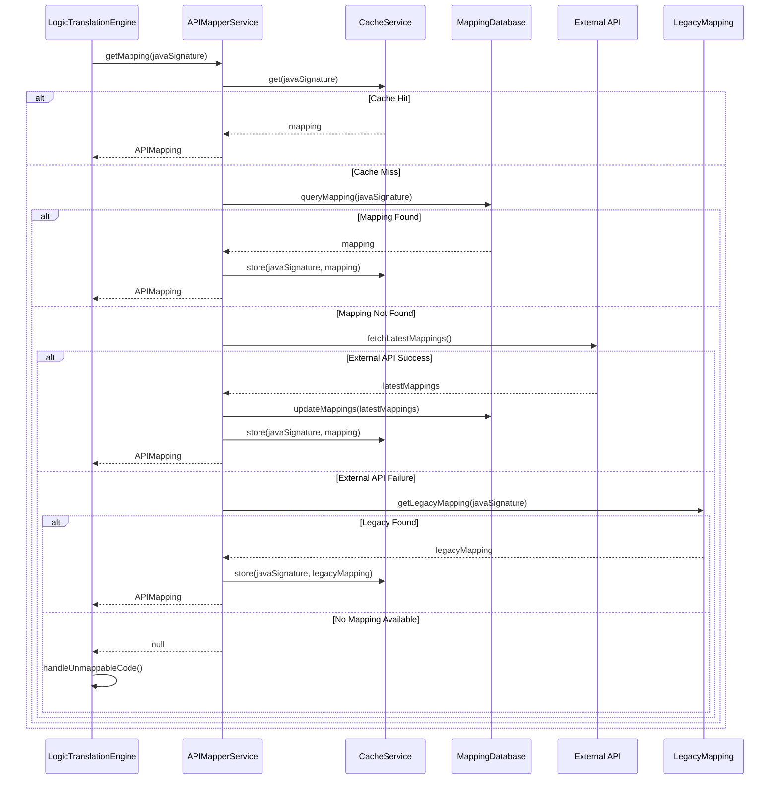
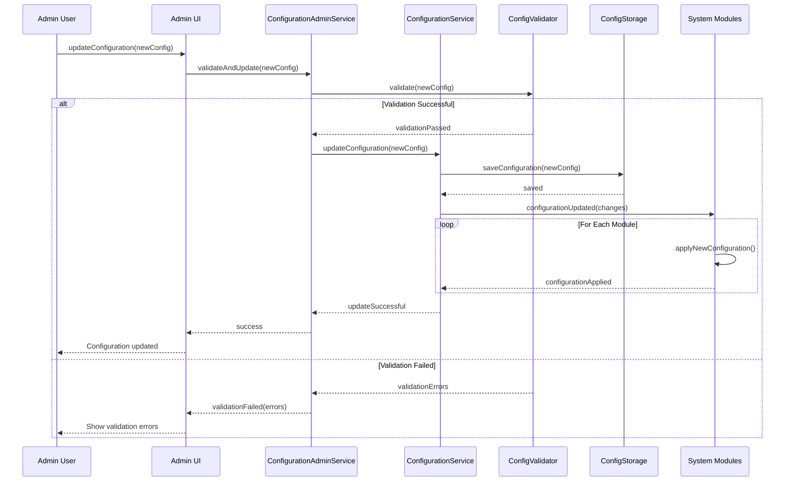
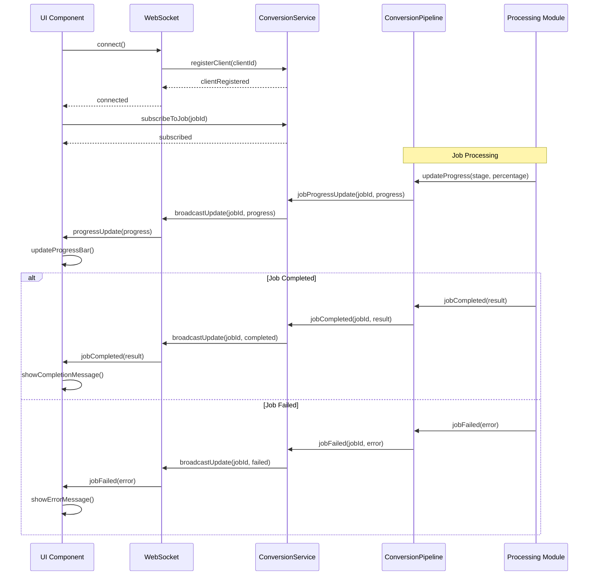
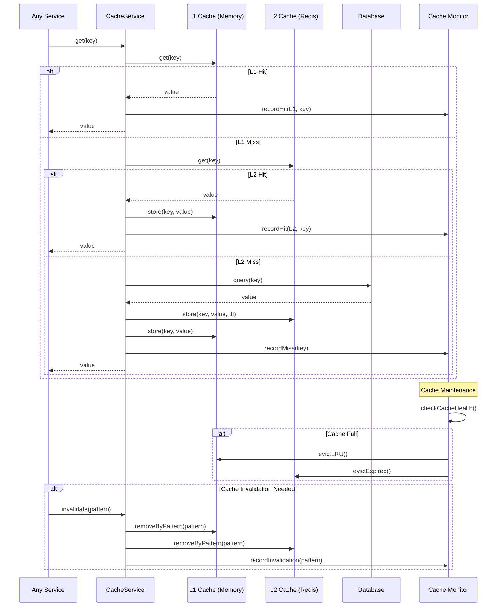

# Sequence Diagrams for Key Processes

This document contains detailed sequence diagrams for the most important processes in the Minecraft Mod Converter system.

## 1. Complete Conversion Process

This diagram shows the full end-to-end conversion process from user request to final output.



## 2. Job Queue Management

This diagram shows how jobs are managed in the queue system with priority and resource allocation.



## 3. Error Handling and Collection

This diagram shows how errors are collected, categorized, and reported throughout the system.



## 4. API Mapping Resolution

This diagram shows how API mappings are resolved with caching and fallback strategies.



## 5. Compromise Strategy Application

This diagram shows how compromise strategies are selected and applied for unmappable features.

```mermaid
sequenceDiagram
    participant LTE as LogicTranslationEngine
    participant CSE as CompromiseStrategyEngine
    participant UP as UserPreferences
    participant Strategies as Strategy Registry
    participant UI as UI Layer
    
    LTE->>CSE: applyStrategy(unmappableFeature)
    CSE->>UP: getUserPreferences(featureType)
    UP-->>CSE: preferences
    
    CSE->>Strategies: getApplicableStrategies(feature, preferences)
    Strategies-->>CSE: strategyList
    
    CSE->>CSE: rankStrategies(strategyList, preferences)
    
    loop For Each Strategy (by rank)
        CSE->>CSE: evaluateStrategy(strategy, feature)
        alt Strategy Applicable
            CSE->>CSE: applyStrategy(strategy, feature)
            
            alt Strategy Successful
                CSE->>UI: notifyUser(strategyApplied)
                CSE-->>LTE: CompromiseResult
                break
            else Strategy Failed
                CSE->>CSE: tryNextStrategy()
            end
        else Strategy Not Applicable
            CSE->>CSE: tryNextStrategy()
        end
    end
    
    alt No Strategy Worked
        CSE->>UI: requestUserDecision(feature)
        UI->>User: showCompromiseOptions()
        User-->>UI: userChoice
        UI-->>CSE: userDecision
        CSE->>CSE: applyUserChoice(userDecision)
        CSE-->>LTE: CompromiseResult
    end
```

## 6. Configuration Management

This diagram shows how configuration is loaded, validated, and updated across the system.



## 7. Real-time Status Updates

This diagram shows how real-time status updates are propagated from the backend to the UI.



## 8. Cache Management

This diagram shows how the caching system manages data across different cache levels.



These sequence diagrams provide detailed views of the most critical processes in the system, showing how components interact over time and how data flows through the system during various operations.