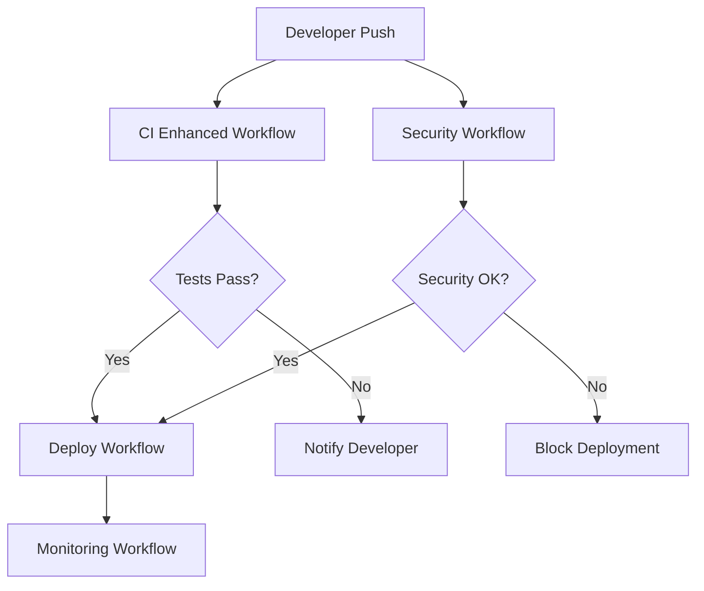

# CI/CD Pipeline Training Guide

## Overview

This comprehensive training guide covers the enhanced GitHub Actions CI/CD pipeline for the ModPorter-AI project. It's designed for developers, DevOps engineers, and operations team members who will be working with the pipeline.

## Learning Objectives

By the end of this training, participants will be able to:

1. Understand the architecture and components of the enhanced CI/CD pipeline
2. Navigate and interpret pipeline workflows and results
3. Troubleshoot common pipeline issues
4. Perform basic pipeline maintenance tasks
5. Follow security best practices for CI/CD operations
6. Execute deployment and rollback procedures

## Prerequisites

- Basic understanding of Git and GitHub
- Familiarity with Node.js and npm
- Basic knowledge of command line operations
- Understanding of software development lifecycle

## Training Modules

### Module 1: Pipeline Architecture Overview (30 minutes)

#### Learning Goals
- Understand the overall pipeline architecture
- Identify key workflow components
- Recognize the flow of code from development to production

#### Content

##### Pipeline Components

The enhanced CI/CD pipeline consists of several interconnected workflows:



##### Key Workflows

1. **CI Enhanced Workflow** (`.github/workflows/ci-enhanced.yml`)
    - Runs on every push and pull request
    - Executes matrix builds across multiple Node.js versions and OS
    - Runs comprehensive test suites
    - Generates coverage reports

2. **Security Workflow** (`.github/workflows/security.yml`)
    - Performs static code analysis
    - Scans for vulnerabilities in dependencies
    - Detects secrets and sensitive information
    - Generates security reports

3. **Deploy Workflow** (`.github/workflows/deploy.yml`)
    - Handles automated deployments to staging and production
    - Implements canary deployment strategy
    - Performs health checks and rollbacks

#### Hands-on Exercise

1. **Explore Workflow Files**
   ```bash
   # Navigate to workflows directory
   cd .github/workflows

   # List all workflow files
   ls -la *.yml

   # Examine the CI workflow
   cat ci-enhanced.yml
   ```

2. **View Recent Workflow Runs**
   ```bash
   # List recent workflow runs
   gh run list --limit 10

   # View details of a specific run
   gh run view [RUN_ID]
   ```

#### Knowledge Check
- What triggers the CI Enhanced Workflow?
- Which workflow is responsible for security scanning?
- How does the pipeline handle deployment failures?

### Module 2: Understanding Workflow Execution (45 minutes)

#### Learning Goals
- Interpret workflow logs and results
- Understand job dependencies and execution flow
- Identify common workflow patterns

#### Content

##### Workflow Anatomy

A typical workflow consists of:

```yaml
name: CI Enhanced
on:
  push:
    branches: [main]
  pull_request:
    branches: [main]

jobs:
  test:
    runs-on: ubuntu-latest
    strategy:
      matrix:
        node-version: [18.x, 20.x, 22.x]
    steps:
      - uses: actions/checkout@v3
      - name: Setup Node.js
        uses: actions/setup-node@v3
        with:
          node-version: ${{ matrix.node-version }}
      - name: Install dependencies
        run: npm ci
      - name: Run tests
        run: npm test
```

##### Matrix Builds

Matrix builds allow testing across multiple configurations:

```yaml
strategy:
  matrix:
    node-version: [18.x, 20.x, 22.x]
    os: [ubuntu-latest, macos-latest, windows-latest]
```

This creates 9 jobs (3 Node versions × 3 operating systems).

##### Job Dependencies

Jobs can depend on other jobs:

```yaml
jobs:
  test:
    runs-on: ubuntu-latest
    # ... test steps

  deploy:
    needs: test  # Only runs if test job succeeds
    runs-on: ubuntu-latest
    # ... deployment steps
```

#### Hands-on Exercise

1. **Analyze a Workflow Run**
   ```bash
   # Find a recent workflow run
   gh run list --workflow=ci-enhanced.yml --limit 1

   # View the run details
   gh run view [RUN_ID] --log
   ```

2. **Examine Matrix Build Results**
    - Navigate to GitHub Actions tab
    - Click on a recent CI workflow run
    - Observe how matrix builds are displayed
    - Compare results across different Node.js versions

3. **Trace Job Dependencies**
    - Identify which jobs run in parallel
    - Find jobs that depend on others
    - Understand the critical path through the pipeline

#### Knowledge Check
- How many jobs does a 3×3 matrix build create?
- What happens if one matrix job fails?
- How do you make a job depend on multiple other jobs?

### Module 3: Security and Compliance (40 minutes)

#### Learning Goals
- Understand security scanning processes
- Recognize security vulnerabilities and their impact
- Follow security best practices in CI/CD

#### Content

##### Security Scanning Types

1. **Static Application Security Testing (SAST)**
    - Analyzes source code for security vulnerabilities
    - Uses CodeQL for comprehensive analysis
    - Identifies common security issues (SQL injection, XSS, etc.)

2. **Dependency Scanning**
    - Checks for known vulnerabilities in dependencies
    - Uses npm audit for built-in vulnerability scanning
    - Provides remediation suggestions and fix options

3. **Secret Scanning**
    - Detects hardcoded secrets in code
    - Uses GitLeaks for pattern-based detection
    - Prevents credential exposure

##### Security Workflow Example

```yaml
name: Security Scan
on: [push, pull_request]

jobs:
  codeql:
    runs-on: ubuntu-latest
    steps:
      - uses: actions/checkout@v3
      - uses: github/codeql-action/init@v2
        with:
          languages: javascript, typescript
      - uses: github/codeql-action/analyze@v2

  dependency-scan:
    runs-on: ubuntu-latest
    steps:
      - uses: actions/checkout@v3
      - name: Install dependencies
        run: npm ci
      - name: Run npm audit
        run: npm audit --audit-level=high --json > npm-audit.json

  secret-scan:
    runs-on: ubuntu-latest
    steps:
      - uses: actions/checkout@v3
      - uses: zricethezav/gitleaks-action@master
```

##### Security Best Practices

1. **Secret Management**
    - Never hardcode secrets in code
    - Use GitHub Secrets for sensitive data
    - Rotate secrets regularly
    - Use least privilege principle

2. **Dependency Management**
    - Keep dependencies up to date
    - Review security advisories
    - Use automated dependency updates
    - Monitor for new vulnerabilities

3. **Code Security**
    - Follow secure coding practices
    - Use static analysis tools
    - Implement security testing
    - Regular security reviews

#### Hands-on Exercise

1. **Run Security Scans Locally**
   ```bash
   # Run dependency audit
   npm audit --audit-level high

   # Fix vulnerabilities
   npm audit fix

   # Scan for secrets
   gitleaks detect --source . --verbose
   ```

2. **Review Security Scan Results**
    - Navigate to Security tab in GitHub
    - Review CodeQL alerts
    - Examine dependency vulnerabilities
    - Check secret scanning results

3. **Practice Secret Management**
   ```bash
   # Set a repository secret
   gh secret set API_KEY --body "your-secret-value"

   # List repository secrets
   gh secret list
   ```

#### Knowledge Check
- What are the three types of security scanning?
- How do you handle a high-severity vulnerability?
- What should you do if secrets are detected in your code?

### Module 4: Deployment and Rollback Procedures (50 minutes)

#### Learning Goals
- Understand deployment strategies
- Execute deployment procedures
- Perform rollback operations
- Monitor deployment health

#### Content

##### Deployment Strategies

1. **Blue-Green Deployment**
    - Maintains two identical production environments
    - Switches traffic between environments
    - Enables instant rollback

2. **Canary Deployment**
    - Gradually rolls out changes to a subset of users
    - Monitors metrics during rollout
    - Reduces risk of widespread issues

3. **Rolling Deployment**
    - Updates instances one at a time
    - Maintains service availability
    - Slower rollout but safer

##### Deployment Workflow

```yaml
name: Deploy
on:
  push:
    branches: [main]

jobs:
  deploy-staging:
    runs-on: ubuntu-latest
    steps:
      - uses: actions/checkout@v3
      - name: Deploy to Staging
        run: ./scripts/deploy-modporter-ai.sh staging
      - name: Run Smoke Tests
        run: ./scripts/run-smoke-tests.sh
      - name: Health Check
        run: curl -f https://staging.modporter.ai/health

  deploy-production:
    needs: deploy-staging
    runs-on: ubuntu-latest
    environment: production
    steps:
      - uses: actions/checkout@v3
      - name: Deploy to Production
        run: ./scripts/deploy-modporter-ai.sh production
      - name: Health Check
        run: curl -f https://api.modporter.ai/health
```

##### Health Checks

Health checks verify deployment success:

```bash
# Basic health check
curl -f https://api.modporter.ai/health

# Detailed health check
curl -s https://api.modporter.ai/health | jq '.'

# Response time check
curl -w "@curl-format.txt" -o /dev/null -s https://api.modporter.ai/health
```

##### Rollback Procedures

1. **Automatic Rollback**
    - Triggered by health check failures
    - Based on error rate thresholds
    - Immediate response to critical issues

2. **Manual Rollback**
    - Initiated by operations team
    - Used for planned rollbacks
    - Requires explicit approval

#### Hands-on Exercise

1. **Practice Deployment Commands**
   ```bash
   # Check deployment readiness
   ./scripts/check-deployment-readiness.sh

   # Deploy to staging (dry run)
   ./scripts/deploy-modporter-ai.sh staging --dry-run

   # Validate deployment
   ./scripts/validate-deployment.js
   ```

2. **Monitor Deployment Health**
   ```bash
   # Check service health
   curl -f https://staging.modporter.ai/health

   # Monitor error rates
   ./scripts/check-error-rates.sh --environment=staging

   # View deployment logs
   kubectl logs deployment/modporter-ai --tail=50
   ```

3. **Practice Rollback**
   ```bash
   # Check rollback readiness
   ./scripts/validate-rollback-readiness.sh

   # Perform rollback (dry run)
   ./scripts/rollback-deployment.sh --dry-run

   # Verify rollback success
   ./scripts/verify-rollback-success.sh
   ```

#### Knowledge Check
- What's the difference between blue-green and canary deployment?
- When should you perform an automatic vs. manual rollback?
- How do you verify a deployment was successful?

### Module 5: Troubleshooting and Maintenance (60 minutes)

#### Learning Goals
- Diagnose common pipeline issues
- Perform routine maintenance tasks
- Optimize pipeline performance
- Handle emergency situations

#### Content

##### Common Issues and Solutions

1. **Build Failures**
   ```bash
   # Check build logs
   gh run view [RUN_ID] --log

   # Reproduce locally
   npm run build

   # Check dependencies
   npm ls --depth=0
   ```

2. **Test Failures**
   ```bash
   # Run specific test
   npm test -- --run src/path/to/test.test.ts

   # Update snapshots
   npm test -- --run --update-snapshots

   # Check for flaky tests
   npm run test:flaky
   ```

3. **Cache Issues**
   ```bash
   # Clear GitHub Actions cache
   gh cache delete --all

   # Verify cache keys
   echo "Cache key: ${{ runner.os }}-node-${{ hashFiles('**/package-lock.json') }}"
   ```

##### Performance Optimization

1. **Build Optimization**
    - Use appropriate cache strategies
    - Parallelize independent jobs
    - Optimize Docker layer caching

2. **Test Optimization**
    - Run tests in parallel
    - Use test sharding
    - Optimize test data setup

3. **Resource Management**
    - Monitor GitHub Actions usage
    - Optimize runner selection
    - Use self-hosted runners when appropriate

##### Maintenance Tasks

1. **Daily Tasks**
    - Review pipeline status
    - Check for failures
    - Monitor performance metrics

2. **Weekly Tasks**
    - Update dependencies
    - Review security scans
    - Optimize cache usage

3. **Monthly Tasks**
    - Performance analysis
    - Cost optimization
    - Process improvements

#### Hands-on Exercise

1. **Diagnose a Build Failure**
    - Find a failed workflow run
    - Analyze the logs
    - Identify the root cause
    - Propose a solution

2. **Optimize Pipeline Performance**
   ```bash
   # Analyze build times
   ./scripts/analyze-build-times.sh

   # Check cache effectiveness
   ./scripts/cache-performance-report.sh

   # Identify bottlenecks
   ./scripts/identify-bottlenecks.sh
   ```

3. **Perform Maintenance Tasks**
   ```bash
   # Update dependencies
   npm update

   # Clean up old caches
   gh cache delete --all --older-than 7d

   # Generate performance report
   ./scripts/generate-performance-report.sh
   ```

#### Knowledge Check
- How do you identify the cause of a build failure?
- What are the key performance metrics to monitor?
- How often should you perform pipeline maintenance?

## Practical Exercises

### Exercise 1: Create a Simple Workflow

Create a workflow that:
1. Runs on push to any branch
2. Installs dependencies
3. Runs linting
4. Runs tests
5. Uploads test results

**Solution:**
```yaml
name: Simple CI
on: push

jobs:
  test:
    runs-on: ubuntu-latest
    steps:
      - uses: actions/checkout@v3
      - uses: actions/setup-node@v3
        with:
          node-version: '20.x'
      - run: npm ci
      - run: npm run lint
      - run: npm test
      - uses: actions/upload-artifact@v3
        with:
          name: test-results
          path: coverage/
```

### Exercise 2: Debug a Failed Workflow

Given a failed workflow run:
1. Identify the failure point
2. Analyze the error message
3. Propose a fix
4. Test the fix locally

### Exercise 3: Implement Security Scanning

Add security scanning to an existing workflow:
1. Add dependency scanning
2. Add secret scanning
3. Configure failure thresholds
4. Set up notifications

### Exercise 4: Set Up Deployment Pipeline

Create a deployment pipeline that:
1. Deploys to staging on main branch
2. Runs smoke tests
3. Deploys to production with approval
4. Includes rollback capability

## Assessment

### Knowledge Assessment (20 questions)

1. **Multiple Choice:** Which workflow file handles security scanning?
    - a) ci-enhanced.yml
    - b) security.yml
    - c) deploy.yml
    - d) monitoring.yml

2. **True/False:** Matrix builds run sequentially to save resources.

3. **Short Answer:** What are the three types of security scanning performed by the pipeline?

4. **Scenario:** A deployment fails health checks. What should happen next?

### Practical Assessment

Participants must:
1. Create a workflow with matrix builds
2. Debug a failing pipeline
3. Implement a security scan
4. Perform a deployment and rollback

## Resources and References

### Documentation
- [GitHub Actions Documentation](https://docs.github.com/en/actions)
- [Enhanced CI/CD Pipeline Guide](../enhanced-cicd-pipeline-guide.md)
- [Troubleshooting Guide](../cicd-troubleshooting-guide.md)
- [Operational Runbook](../cicd-operational-runbook.md)

### Tools and Commands
- [GitHub CLI](https://cli.github.com/)
- [Node.js and npm](https://nodejs.org/)
- [Docker](https://www.docker.com/)
- [kubectl](https://kubernetes.io/docs/reference/kubectl/)

### Best Practices
- [Security Best Practices](https://docs.github.com/en/actions/security-guides)
- [Performance Optimization](https://docs.github.com/en/actions/using-workflows/caching-dependencies-to-speed-up-workflows)
- [Workflow Syntax](https://docs.github.com/en/actions/using-workflows/workflow-syntax-for-github-actions)

## Certification

Upon successful completion of this training, participants will receive:
- Certificate of completion
- Access to advanced training modules
- Invitation to CI/CD community of practice

### Continuing Education
- Monthly pipeline updates training
- Security awareness sessions
- Performance optimization workshops
- New tools and technologies briefings

---

## Training Schedule

### Self-Paced Learning
- Estimated time: 4-6 hours
- Complete at your own pace
- Access to online materials 24/7

### Instructor-Led Training
- Duration: 1 full day (8 hours)
- Includes hands-on exercises
- Q&A sessions with experts
- Group discussions and case studies

### Follow-up Sessions
- 30-day check-in: Address questions and challenges
- 90-day review: Advanced topics and optimization
- Quarterly updates: New features and best practices

---

*This training guide is maintained by the DevOps team. For questions or feedback, contact devops-training@company.com*
